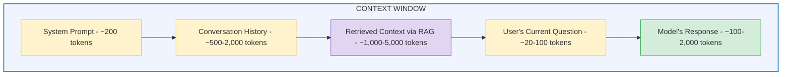

# LLMs Explained: The Mental Model Every Engineer Needs

## What This Guide Covers

You don't need to understand the math behind transformer architectures to build with LLMs effectively. But you do need a working mental model of how they behave — what they're good at, where they fail, and why. This guide gives you that mental model.

---

## What Is a Large Language Model?

An LLM is a neural network trained on massive amounts of text that learns to predict the next token (word fragment) given everything that came before it. That's it. Every impressive behavior — writing code, summarizing documents, answering questions, having conversations — emerges from this one capability: next-token prediction at scale.

**The key insight:** LLMs don't "understand" in the human sense. They are extraordinarily sophisticated pattern-matching machines. They've seen so much text that they can generate responses that appear intelligent, but they're always predicting "what text is most likely to come next given this input?"

This distinction matters because it explains both their strengths (fluent, contextual generation) and their weaknesses (hallucination, inability to verify facts, sensitivity to prompt phrasing).

---

## Tokens: The Atomic Unit

LLMs don't process words — they process **tokens**. A token is a fragment of text, typically 3-4 characters or roughly ¾ of a word.

**Examples of tokenization:**

```
"Hello, world!"        → ["Hello", ",", " world", "!"]           = 4 tokens
"Artificial intelligence" → ["Art", "ificial", " intelligence"]  = 3 tokens  
"$38,000,000"          → ["$", "38", ",", "000", ",", "000"]     = 6 tokens
```

**Why tokens matter:**
- **Cost:** API pricing is per-token (input + output). A 1,000-word prompt ≈ 750 tokens ≈ ~$0.01 with GPT-4o.
- **Context window:** The maximum tokens the model can process at once. Everything — system prompt, conversation history, retrieved documents, the user's question, AND the generated response — must fit within this window.
- **Speed:** More tokens = longer generation time. A 100-token response is near-instant; a 10,000-token response takes several seconds.

**Useful approximations:**
- 1 token ≈ ¾ of a word (English)
- 1,000 tokens ≈ 750 words ≈ 1.5 pages
- 100K tokens ≈ 75,000 words ≈ a full novel
- 1M tokens ≈ 750,000 words ≈ ~1,500 pages

---

## The Context Window

The context window is the model's "working memory" — everything it can see at once. It includes:



**Context window sizes (2026):**

| Model | Context Window | Approximate Pages |
|---|---|---|
| GPT-3.5 (2022) | 4,096 tokens | ~3 pages |
| GPT-4 (2023) | 32,768 tokens | ~25 pages |
| GPT-4o (2024) | 128,000 tokens | ~96 pages |
| Claude 3.5 (2024) | 200,000 tokens | ~150 pages |
| Gemini 1.5 Pro (2025) | 1,000,000 tokens | ~750 pages |
| Gemini 2.0 (2026) | 2,000,000 tokens | ~1,500 pages |

**What happens when you exceed the window?** The oldest content gets dropped (truncated). The model literally forgets the beginning of the conversation. This is why memory management and context compression strategies matter.

---

## Temperature: The Creativity Dial

Temperature controls how "random" the model's token selection is.

**Low temperature (0.0 - 0.3):**
- Model picks the most probable next token every time
- Responses are consistent, deterministic, factual
- Best for: data analysis, factual Q&A, code generation, financial reports

**High temperature (0.7 - 1.0):**
- Model considers less probable tokens, introducing variety
- Responses are creative, diverse, sometimes surprising
- Best for: brainstorming, creative writing, generating alternatives

**Example with the same prompt:**

```
Prompt: "Describe Q3 performance in one sentence."

Temperature 0.0: "Q3 revenue of $38M represented a 14% year-over-year increase 
                  driven by strong growth in the digital and cloud practice."

Temperature 0.3: "Q3 revenue of $38M reflected solid growth of 14% compared to 
                  the prior year, with digital and cloud leading the way."

Temperature 0.9: "The third quarter was a breakout period — $38M in revenue 
                  shattered expectations and signaled that our strategic bets 
                  in digital and cloud are paying real dividends."
```

**For the C-suite dashboard:** Temperature should be LOW (0.0-0.2). Executives need consistent, reliable answers about financial data — not creative interpretations.

---

## Hallucination: The Core Risk

Hallucination is when the model generates confident, plausible-sounding text that is factually wrong. It's not a bug — it's a fundamental consequence of how language models work.

**Why it happens:** The model predicts the most likely next token. If the prompt asks "What was Q3 revenue?" and the model hasn't been given the actual data, it will generate a plausible-sounding number based on patterns in its training data. It doesn't know it's wrong. It doesn't have a concept of "wrong." It just produces the most statistically likely continuation.

**Types of hallucination:**
- **Factual fabrication:** Inventing numbers, dates, or events ("Q3 revenue was $45M" when it was actually $38M)
- **Source fabrication:** Citing documents or studies that don't exist
- **Confident uncertainty:** Stating something definitively when the model should say "I don't know"
- **Plausible reasoning:** Generating a logical-sounding but incorrect chain of reasoning

**How to mitigate hallucination:**
1. **RAG** — give the model real data to ground its responses
2. **Low temperature** — reduce randomness in token selection
3. **System prompts** — instruct the model to say "I don't have that data" when uncertain
4. **Output validation** — check AI responses against source data before displaying
5. **Source citation** — require the model to cite which retrieved document supports each claim

---

## Inference: Running the Model

**Training** is teaching the model (adjusting weights on massive data). It's done once, by the model provider (OpenAI, Anthropic, etc.), and costs millions of dollars.

**Inference** is using the trained model to generate responses. Every time you ask ChatGPT a question, that's inference. This is the ongoing cost of running AI systems.

**Cost structure:**
- Training: one-time, enormous ($millions-$100M+), done by provider
- Inference: per-request, small ($0.001-$0.10 per query), paid by you

**What affects inference cost:**
- Number of input tokens (your prompt + context)
- Number of output tokens (the response)
- Model size (GPT-4o is cheaper than GPT-5)
- Speed tier (faster responses cost more on some providers)

**What affects inference speed:**
- Input size (more tokens to process = slower first token)
- Output length (longer responses take longer to generate)
- Model size (larger models are slower)
- Concurrent demand (shared infrastructure can have queuing)

---

## The Model Landscape (2026)

| Provider | Key Models | Strengths | Best For |
|---|---|---|---|
| **OpenAI** | GPT-5, GPT-4o, GPT-5.3-Codex | Broad capability, strong reasoning, best coding | General enterprise, coding agents |
| **Anthropic** | Claude 4, Claude 3.5 Sonnet | Long context (200K), safety, document analysis | Document-heavy tasks, regulated environments |
| **Google** | Gemini 2.0, Gemini 1.5 Pro | Largest context window (2M), multimodal | Large document analysis, multimodal |
| **Meta** | Llama 3, Llama 4 | Open-source, self-hostable, free | On-premise deployments, cost-sensitive |
| **Mistral** | Mistral Large, Mistral Medium | European, strong multilingual, efficient | EU data residency, multilingual |

**The enterprise approach:** Most production systems don't commit to one model. They use the right model for each task — cheaper/faster models for simple queries, more capable models for complex reasoning. Microsoft's M365 Copilot explicitly uses multi-model intelligence, routing each task to the best model.

---

## Key Takeaways

1. **LLMs are next-token predictors.** Every behavior — good and bad — stems from this. They don't "know" things; they predict likely continuations.

2. **Tokens are the currency.** They determine cost, speed, and what fits in the context window. Always be aware of how many tokens your system is consuming.

3. **The context window is the bottleneck.** Everything the model needs to know must fit inside it. This is why RAG (selective retrieval) and context management matter.

4. **Temperature is your quality dial.** Low for facts, high for creativity. For enterprise dashboards: keep it low.

5. **Hallucination is the primary risk.** The model will always generate something — even when it should say "I don't know." Your architecture must account for this.

6. **Inference cost scales with usage.** A system processing 10,000 queries/day needs careful cost management. This is where RAG vs. long context trade-offs matter.
