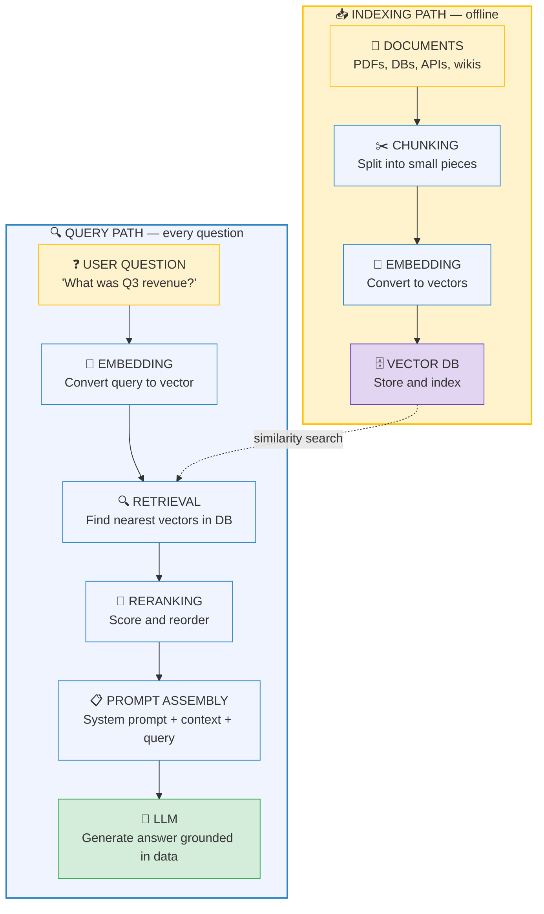
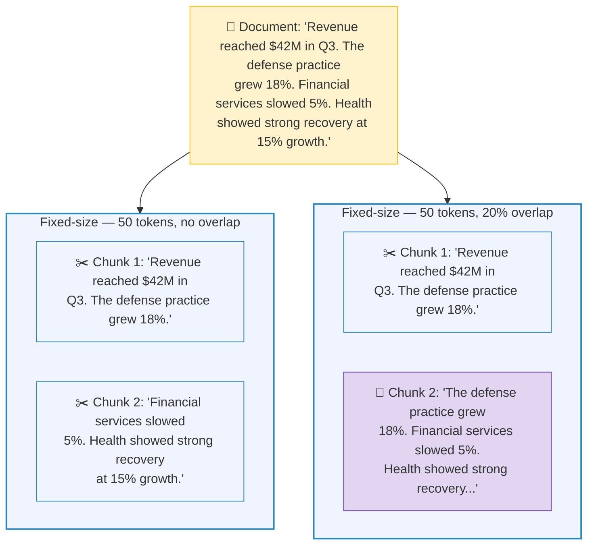
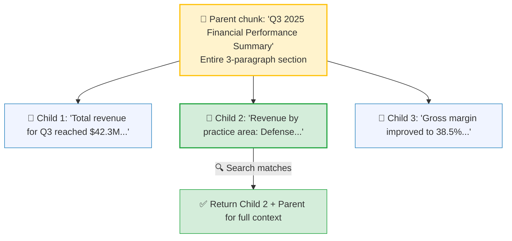
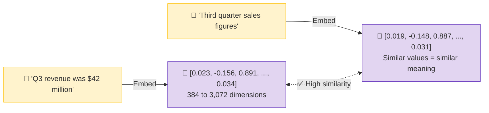
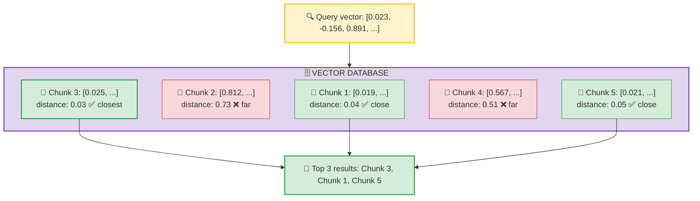
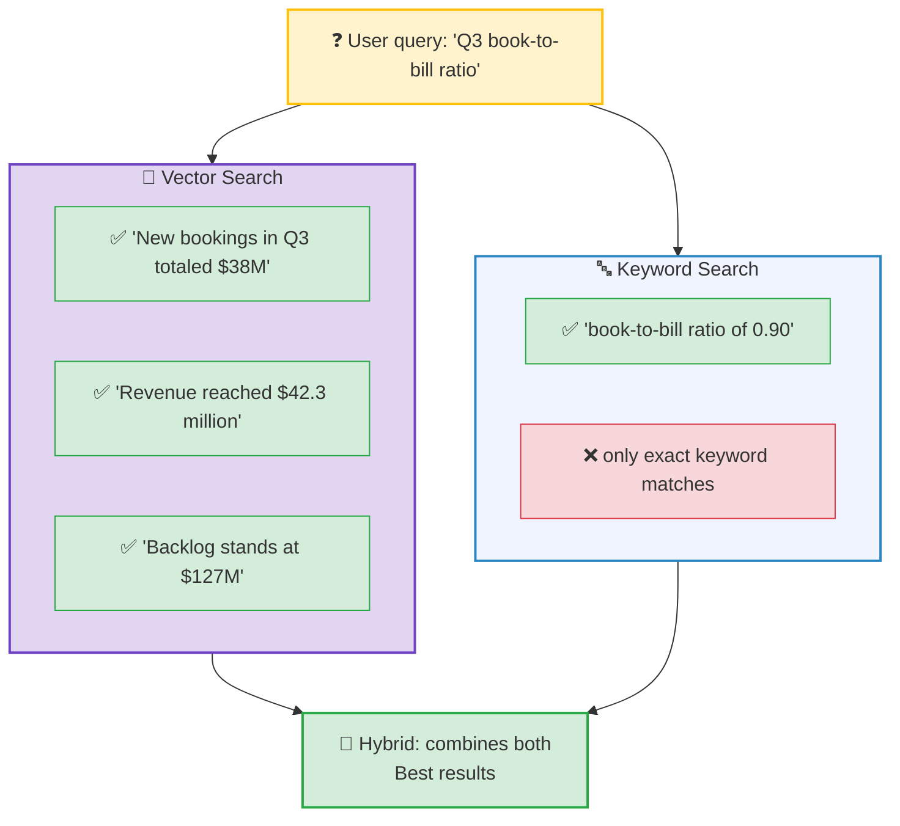
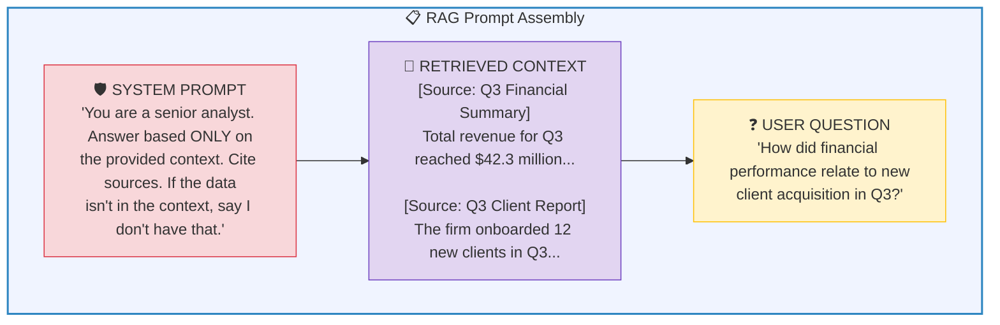
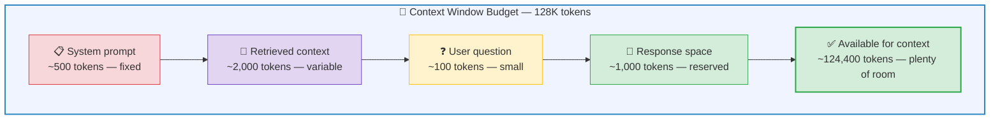
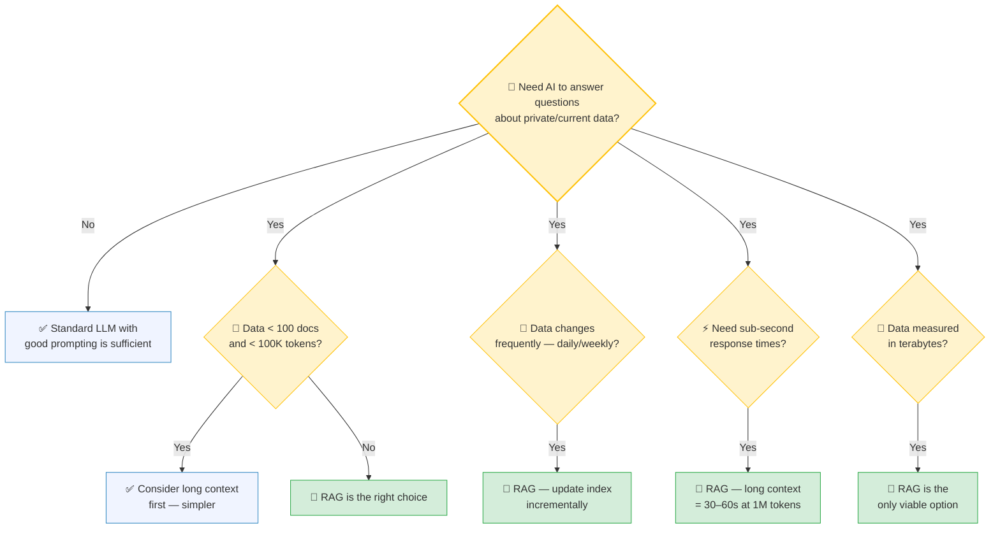

# RAG Deep Dive

## The Full Pipeline from Document to Answer

---

## What This Guide Covers

This is the engineering deep dive into Retrieval-Augmented Generation. If you've read [01 — From Prompt Engineering to Context Engineering](01-prompt-engineering-to-context-engineering.md), you saw the RAG pipeline at a high level. This guide takes you inside each component — chunking strategies, embedding models, vector databases, retrieval techniques, and reranking — with the decision frameworks you need to choose the right approach for production systems.

**The analogy:** RAG is a librarian. Not the kind that points you to the right shelf — the kind that reads every relevant page across every relevant book, pulls out the exact paragraphs you need, and hands them to you with citations. The AI then reads those paragraphs and writes your answer.

---

## The RAG Pipeline: End to End

There are two paths in every RAG system — the **indexing path** (one-time, when data changes) and the **query path** (every time a user asks a question):

The indexing path runs when your data changes (daily, weekly, or on-demand). The query path runs in real-time for every user question. The key insight: **most of the engineering complexity is in the indexing path.** Get that right, and queries are fast and accurate.

---

## Step 1: Document Ingestion

### Where Data Comes From

In enterprise environments, RAG data rarely comes from a single clean source:

| Source Type | Examples | Preprocessing Needed |
|---|---|---|
| **Structured documents** | PDFs, Word docs, slide decks | Extract text, preserve tables, handle images |
| **Databases** | PostgreSQL, SQL Server, Snowflake | Export to text, include schema context |
| **APIs** | Salesforce, ServiceNow, JIRA | Serialize responses, handle pagination |
| **Collaboration tools** | SharePoint, Confluence, Teams | Extract content, strip formatting |
| **Emails & messages** | Outlook, Slack channels | Filter noise, preserve thread context |
| **Code repositories** | GitHub, Azure DevOps | Parse by function/class, include docstrings |

### Preprocessing Pipeline

Before chunking, raw data needs cleaning:

1. **Text extraction** — Convert PDFs, DOCX, HTML to plain text. Tools: `pypdf`, `unstructured`, Azure Document Intelligence.
2. **Deduplication** — Remove duplicate documents (common in SharePoint/Confluence environments).
3. **Metadata extraction** — Pull titles, authors, dates, categories. This metadata becomes critical for filtering during retrieval.
4. **Quality filtering** — Remove boilerplate (footers, headers, navigation text) that would pollute embeddings.

**Enterprise reality:** For the consulting firm's C-suite dashboard, the data pipeline pulls from 4 sources: the financial data warehouse (structured), practice area reports (PDFs), HR system (API), and client CRM (Salesforce via MCP). Each source requires a different extraction strategy.

---

## Step 2: Chunking Strategies

Chunking is where most RAG pipelines succeed or fail. The goal: create pieces small enough to be precise, but large enough to be meaningful.

### Strategy 1: Fixed-Size Chunking

Split text into chunks of N tokens with optional overlap.

**Pros:** Simple, predictable chunk sizes, easy to implement.
**Cons:** Can split sentences mid-thought, ignores document structure.

### Strategy 2: Semantic Chunking

Split at natural boundaries — paragraphs, sections, topic shifts.

**Pros:** Preserves meaning within chunks, respects document structure.
**Cons:** Uneven chunk sizes (some too small, some too large), harder to implement.

### Strategy 3: Overlapping Chunking

Any strategy combined with overlap at boundaries, so context isn't lost between chunks.

**Pros:** Catches information that falls at boundaries.
**Cons:** Increases storage and indexing time (10-20% more chunks).

### Strategy 4: Hierarchical (Parent-Child)

Two levels: parent chunks (full sections) and child chunks (paragraphs within sections). Retrieve the child, include the parent for context.

**Pros:** Best of both worlds — precise retrieval with broad context.
**Cons:** Complex to implement, requires careful parent-child linking.

### Strategy 5: Sentence-Window

Each chunk is a single sentence, but retrieval returns the sentence plus surrounding sentences (a "window").

**Pros:** Maximum precision in matching. Great for factual lookups.
**Cons:** Tiny chunks can lack context, window expansion adds latency.

### Decision Framework

| Factor | Fixed-Size | Semantic | Overlapping | Hierarchical | Sentence-Window |
|---|---|---|---|---|---|
| **Implementation complexity** | Low | Medium | Low | High | Medium |
| **Retrieval precision** | Medium | High | Medium | Very High | Very High |
| **Context preservation** | Low | High | Medium | Very High | Medium |
| **Storage overhead** | Low | Low | Medium | High | Low |
| **Best for** | Quick prototypes | Most production use | Boundary-sensitive data | Complex docs with sections | Factual Q&A |

> **Recommendation for most enterprise RAG:** Start with semantic chunking + 10-15% overlap. Move to hierarchical if your documents have clear section structure (which most reports do).

For hands-on comparison, see [Notebook 03 — Chunking Strategies Compared](../notebooks/03-chunking-strategies.ipynb).

---

## Step 3: Embedding Models

The embedding model determines how well your system understands meaning. It converts text into high-dimensional vectors where semantic similarity maps to vector proximity.

### How Embeddings Work

### Model Comparison (2026)

| Model | Dimensions | Cost | Self-Hostable | Best For |
|---|---|---|---|---|
| **OpenAI text-embedding-3-large** | 3,072 | ~$0.13/1M tokens | No | General-purpose, highest quality |
| **OpenAI text-embedding-3-small** | 1,536 | ~$0.02/1M tokens | No | Cost-sensitive production |
| **Cohere embed-v3** | 1,024 | ~$0.10/1M tokens | No | Multilingual, strong retrieval |
| **all-MiniLM-L6-v2** | 384 | Free | Yes | Prototyping, air-gapped environments |
| **bge-large-en-v1.5** | 1,024 | Free | Yes | Production-grade open-source |
| **nomic-embed-text** | 768 | Free | Yes | Long documents (8K context) |

**Enterprise decision factors:**
- **FedRAMP/air-gapped:** Must self-host → open-source models only
- **Cost at scale:** 1M+ chunks → consider open-source or embedding-3-small
- **Multilingual:** Global consulting → Cohere embed-v3
- **Maximum quality:** Budget allows cloud APIs → embedding-3-large

To visualize how embeddings capture meaning, see [Notebook 04 — Embeddings Explorer](../notebooks/04-embeddings-explorer.ipynb).

---

## Step 4: Vector Databases

Vector databases are purpose-built for storing embeddings and running similarity search at scale. They're not general-purpose databases — they're optimized for the specific operation: "given this query vector, find the K nearest vectors."

### How Similarity Search Works

### Database Comparison

| Database | Type | Hybrid Search | Metadata Filtering | Scale | FedRAMP | Best For |
|---|---|---|---|---|---|---|
| **Azure AI Search** | Managed | ✅ Vector + keyword | ✅ Rich filters | Billions | ✅ | Microsoft enterprise shops |
| **Pinecone** | Managed | ✅ | ✅ | Billions | ❌ | Startups, fast prototyping |
| **Weaviate** | Open-source | ✅ | ✅ | Millions | Self-host | Flexible, self-hosted |
| **Qdrant** | Open-source | ✅ | ✅ Rich | Billions | Self-host | High performance, self-hosted |
| **ChromaDB** | Open-source | ❌ | ✅ Basic | Thousands | Self-host | Learning, prototyping |
| **pgvector** | Extension | ❌ | ✅ Full SQL | Millions | Depends | Already using PostgreSQL |

> **For regulated enterprise environments:** Azure AI Search if you're in the Microsoft ecosystem (FedRAMP-authorized). Qdrant or Weaviate self-hosted if you need on-premise control. ChromaDB is excellent for learning (see our notebooks) but not for production at scale.

---

## Step 5: Retrieval and Reranking

Retrieval is where the query meets the data. The goal: find the most relevant chunks for the user's question.

### Retrieval Methods

**1. Vector-only (semantic search):**
Convert query to vector, find nearest neighbors. Works well for conceptual questions ("How is employee morale?") but can miss exact matches ("What was the Q3 book-to-bill ratio?").

**2. Keyword-only (BM25/TF-IDF):**
Traditional full-text search. Great for exact terms and technical jargon, but misses semantic similarity.

**3. Hybrid search (vector + keyword):**
Run both searches, combine results. This is the production standard — it catches both conceptual and exact matches.

### Reranking: The Second Filter

Initial retrieval casts a wide net — top 10-20 results. A **reranker** then scores each result for relevance to the specific question and reorders them.

```mermaid
graph LR
    subgraph BEFORE["🔍 Initial Retrieval — top 5"]
        B1["1. Revenue data — 0.82"]
        B2["2. Headcount data — 0.78"]
        B3["3. Book-to-bill ratio — 0.75"]
        B4["4. Client satisfaction — 0.73"]
        B5["5. Backlog data — 0.71"]
    end

    BEFORE -->|"🎯 Rerank"| AFTER

    subgraph AFTER["✅ After Reranking"]
        A1["1. Book-to-bill ratio — 0.95 ⬆️"]
        A2["2. Revenue data — 0.88"]
        A3["3. Backlog data — 0.82 ⬆️"]
        A4["4. Headcount data — 0.45 ⬇️"]
        A5["5. Client satisfaction — 0.31 ⬇️"]
    end

    style BEFORE fill:#fff3cd,stroke:#ffc107,stroke-width:2px
    style AFTER fill:#d4edda,stroke:#28a745,stroke-width:2px
    style A1 fill:#d4edda,stroke:#28a745
    style A2 fill:#d4edda,stroke:#28a745
    style A3 fill:#d4edda,stroke:#28a745
    style A4 fill:#f8d7da,stroke:#dc3545
    style A5 fill:#f8d7da,stroke:#dc3545
```

**Why reranking matters:** Initial retrieval uses fast but approximate similarity (bi-encoder). Reranking uses slower but more precise cross-attention (cross-encoder) that reads the query and document together. This catches cases where a chunk is similar in topic but not actually relevant to the specific question.

**Common rerankers:** Cohere Rerank, `bge-reranker-v2`, `ms-marco-MiniLM-L-6-v2` (open-source).

---

## Step 6: Prompt Assembly

The final step before the LLM: assembling all retrieved context into a well-structured prompt.

### The Anatomy of a RAG Prompt

### Token Budget Management

The context window has a fixed size. You need to allocate it wisely:

At 128K tokens, budget is rarely an issue. But at 4K-8K tokens (older models, cheaper tiers), you must be strategic: fewer chunks, shorter system prompts, compressed context.

---

## Evaluating RAG Quality

Building the pipeline is half the work. Measuring whether it actually works well is the other half.

### The Three Dimensions of RAG Quality

| Dimension | Question It Answers | How to Measure |
|---|---|---|
| **Retrieval quality** | Did we find the right chunks? | Recall@K, precision@K, MRR |
| **Faithfulness** | Does the answer match the retrieved context? | LLM-as-judge, NLI models |
| **Answer correctness** | Is the final answer actually right? | Human evaluation, ground truth comparison |

### Common Failure Modes

1. **Retrieval miss:** The right information exists in your data but the retrieval pipeline doesn't find it. Fix: better chunking, hybrid search, reranking.
2. **Hallucination despite context:** The LLM ignores the retrieved data and makes something up. Fix: stronger system prompt guardrails, lower temperature.
3. **Wrong context, right format:** Retrieval returns plausible-looking but wrong chunks, and the LLM confidently answers from them. Fix: reranking, metadata filtering.
4. **Boundary split:** The answer spans two chunks that got split apart during chunking. Fix: overlapping chunks, hierarchical chunking.

---

## Decision Framework: Should You Build RAG?

---

## Key Takeaways

1. **RAG has two paths — indexing and querying.** The indexing path (chunk, embed, store) runs offline. The query path (embed question, search, rerank, generate) runs in real-time. Most engineering effort goes into the indexing path.

2. **Chunking strategy is the #1 lever.** Bad chunking produces bad embeddings, which produce bad retrieval, which produces bad answers. Start with semantic chunking + overlap for most use cases.

3. **Hybrid search (vector + keyword) is the production standard.** Vector-only misses exact terms. Keyword-only misses semantic meaning. Hybrid catches both.

4. **Reranking is cheap insurance.** A cross-encoder reranker after initial retrieval catches false positives and dramatically improves precision. Always add one in production.

5. **Measure what matters.** Retrieval quality, faithfulness, and answer correctness are three separate dimensions. A system can have perfect retrieval but still hallucinate, or perfect generation but retrieve the wrong chunks.

---

### Related Content
- **[RAG vs Long Context](05-rag-vs-long-context.md)** — When to use RAG, when long context wins
- **[Notebook 01 — Semantic Search Visualized](../notebooks/01-semantic-search-visualized.ipynb)** — See how embeddings and similarity work
- **[Notebook 02 — Build a RAG Pipeline](../notebooks/02-build-a-rag-pipeline.ipynb)** — Build a working RAG system step by step
- **[Notebook 03 — Chunking Strategies Compared](../notebooks/03-chunking-strategies.ipynb)** — Hands-on comparison of chunking approaches
