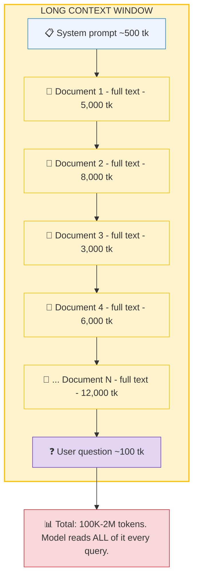
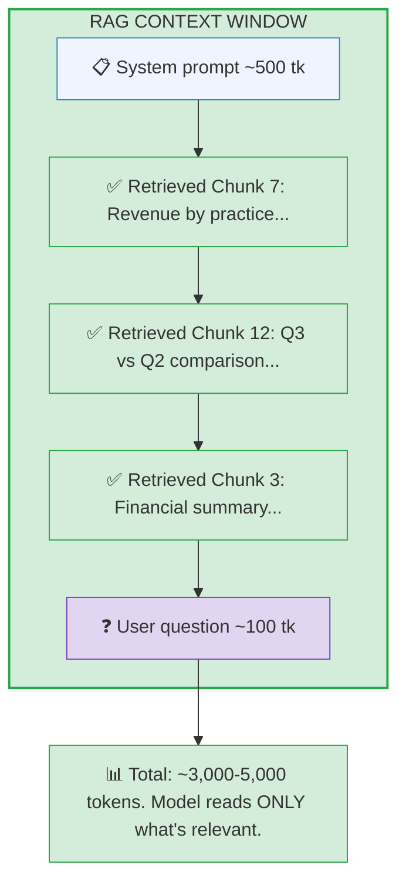
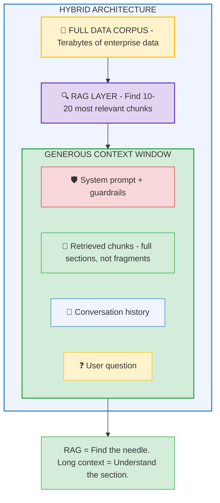
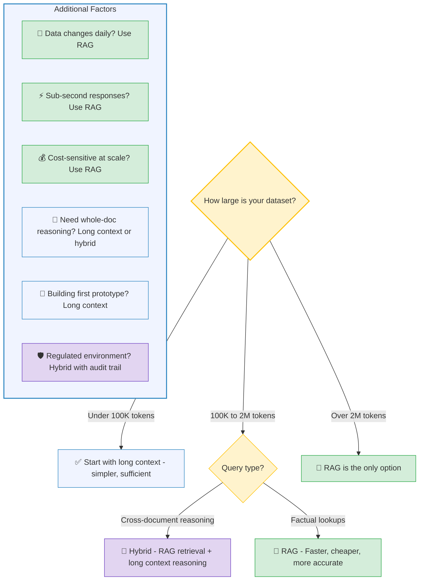

# RAG vs Long Context

## The Real Trade-Offs

---

## The Debate

Context windows exploded from 4K tokens in 2022 to 2M tokens in 2026. With models that can read 1,500 pages in a single prompt, do you still need the complexity of RAG? Can you just dump everything in and ask your question?

**The short answer:** It depends on scale, cost, speed, and accuracy. And in production, the best teams use both.

This guide breaks down exactly when each approach wins, when it loses, and why the hybrid approach is the 2026 consensus.

---

## How Each Approach Works

### Long Context: The "Everything Bagel"

Load all your data directly into the prompt. The model reads everything and answers from the full corpus.



**The appeal:** Zero infrastructure. No chunking, no embeddings, no vector database, no retrieval pipeline. Just paste and ask.

### RAG: The "Surgical Retrieval"

Retrieve only the specific pieces relevant to each question. The model reads a focused subset.



**The appeal:** Fast, cheap, scales to any data size, and the model focuses on exactly what matters.

---

## When Long Context Wins

### 1. Collapsing Infrastructure Complexity

RAG has moving parts: chunking pipeline, embedding model, vector database, retrieval logic, reranking. Each component can fail, each needs monitoring, and each introduces engineering decisions. Long context eliminates all of it.

**For teams building their first AI prototype:** loading 50 pages of reports into a large context window and asking questions is a legitimate strategy. Ship fast, prove value, optimize later.

### 2. Avoiding the Retrieval Lottery

RAG can silently fail. If chunking splits a critical paragraph, or the embedding doesn't capture the right nuance, or the similarity threshold filters out the answer — you get wrong results and the user never knows.

Long context avoids this because the model sees everything. The answer is always "in there" — the question is whether the model can find it in a sea of tokens.

### 3. Whole-Document Reasoning

Some questions require understanding a document's full structure — how the introduction relates to the conclusion, how Section 3 contradicts Section 7, what the overall narrative arc is. RAG retrieves fragments. Long context sees the forest.

**Example:** "Does this 80-page contract have any clauses that conflict with our standard terms?" requires reading the whole contract. RAG would retrieve individual clauses but miss the cross-clause conflicts.

---

## When RAG Wins

### 1. The Re-Reading Tax

With long context, the model processes your **entire** data corpus on every single query. 100 questions about the same dataset? The model reads the full dataset 100 times.

| Metric | RAG | Long Context (1M tokens) |
|---|---|---|
| **Tokens processed per query** | ~3,000-5,000 | ~1,000,000 |
| **Average cost per query** | ~$0.0001 | ~$2-10 |
| **Average latency** | ~1-2 seconds | ~30-60 seconds |
| **Cost at 1,000 queries/day** | ~$3/day | ~$2,000-10,000/day |
| **Cost at 10,000 queries/day** | ~$30/day | ~$20,000-100,000/day |

At scale, RAG is roughly **1,250x cheaper per query**. For the consulting firm's C-suite dashboard processing 340 queries per day, this is the difference between ~$10/day and ~$3,400/day.

### 2. Lost in the Middle

As context grows, LLM accuracy degrades — especially for information buried in the middle of the context. Stanford's "Lost in the Middle" research found a **U-shaped accuracy curve**: models perform well with information at the beginning or end, but accuracy drops 30%+ for information in the middle.

```mermaid
xychart-beta
    title "Accuracy vs. Position in Context (Lost in the Middle)"
    x-axis ["Start", "", "", "", "Middle", "", "", "", "End"]
    y-axis "Accuracy %" 50 --> 100
    line [97, 93, 88, 78, 62, 65, 78, 90, 97]
```

> The U-shaped curve shows ~30%+ accuracy drop for information in the middle of context. Beginning and end positions maintain high accuracy, while the middle is a danger zone.

At 1M tokens, there is a **lot** of "middle." Even Gemini 2.0 Pro maintains only ~77% accuracy at full context load — meaning roughly 1 in 4 retrievals may miss. For a dashboard where executives need accurate numbers, that error rate is unacceptable.

RAG sidesteps this entirely by only placing 3-5 relevant chunks in the context. Less noise, higher accuracy.

### 3. The Infinite Dataset Problem

No context window — even at 2M tokens (~1,500 pages) — can hold an enterprise data lake. A Fortune 500's worth of financial data, HR records, client files, and project documentation is measured in terabytes, not megabytes.

Long context works for "this specific document." It does not work for "all of our data across all practice areas for the last 5 years."

At enterprise scale, RAG is the only viable architecture.

### 4. Data Freshness

Long context requires reloading the entire corpus when data changes. RAG allows incremental updates — add a new document to the vector database without reprocessing everything else.

For data that changes daily (CRM updates, project status, financial feeds), RAG's incremental indexing is a significant operational advantage.

---

## The Hybrid Approach: Best of Both Worlds

The 2026 consensus among production teams: **use RAG for retrieval, long context for reasoning.**



**How it works in practice:**
1. RAG retrieves the top 10-20 relevant chunks (including parent sections for context)
2. Instead of stuffing only the tiny chunks into the prompt, you include their broader surrounding context
3. The model gets a generous but focused view — enough to reason across multiple data points, but not so much that it gets lost

This combination outperforms either approach alone. RAG provides precision (find the right data); long context provides depth (understand the data thoroughly).

---

## Decision Framework



---

## Key Takeaways

1. **Long context is not RAG's replacement — it's RAG's complement.** The teams shipping the best AI products in 2026 use both.

2. **Cost and latency make RAG mandatory at scale.** At 1,000+ queries/day, long context is 1,250x more expensive. For interactive dashboards, 30-60s latency is unacceptable.

3. **"Lost in the middle" is real.** More context doesn't always mean better answers. RAG's precision — giving the model only what matters — often produces more accurate results than drowning it in data.

4. **Start simple, add complexity when needed.** For prototypes with small datasets, long context is fine. Migrate to RAG when your data outgrows the context window or your query volume outgrows your budget.

5. **The hybrid architecture is the production standard.** RAG for retrieval precision, long context for reasoning depth. This is the architecture behind the consulting firm's C-suite dashboard.

---

### Related Content
- **[RAG Deep Dive](04-rag-deep-dive.md)** — Full pipeline engineering details
- **[Common GenAI Misconceptions](06-misconceptions.md)** — Why RAG is not training
- **[Notebook 05 — RAG vs Long Context Benchmark](../notebooks/05-rag-vs-long-context.ipynb)** — Run the comparison yourself
