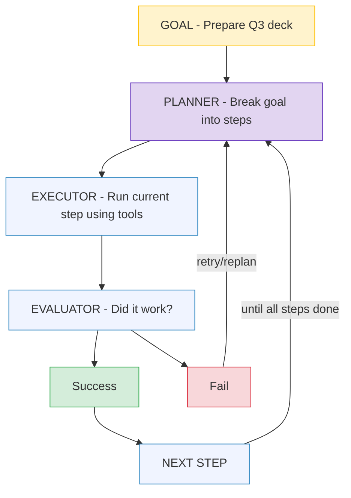
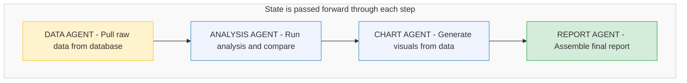
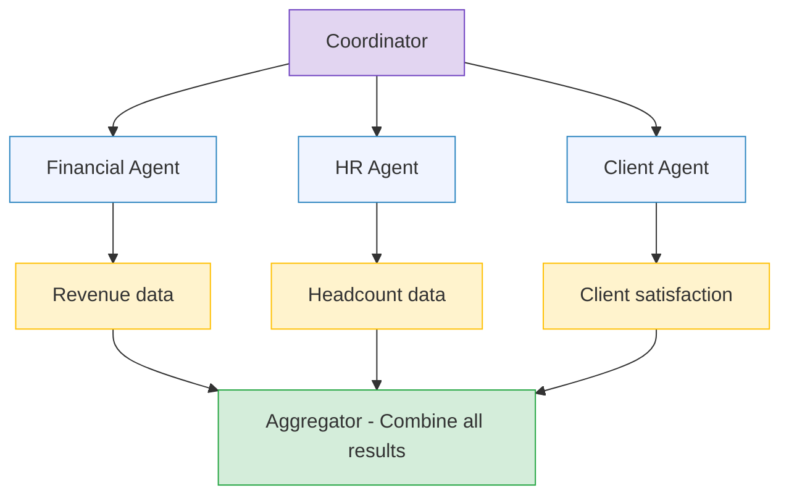
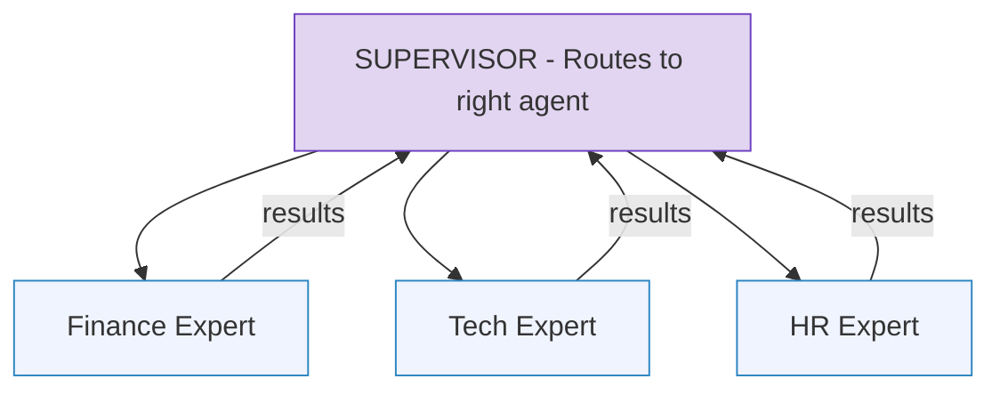
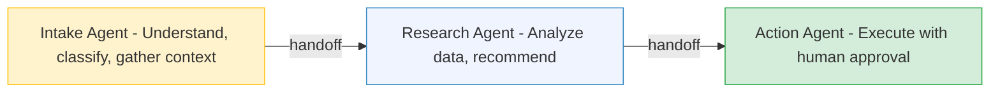
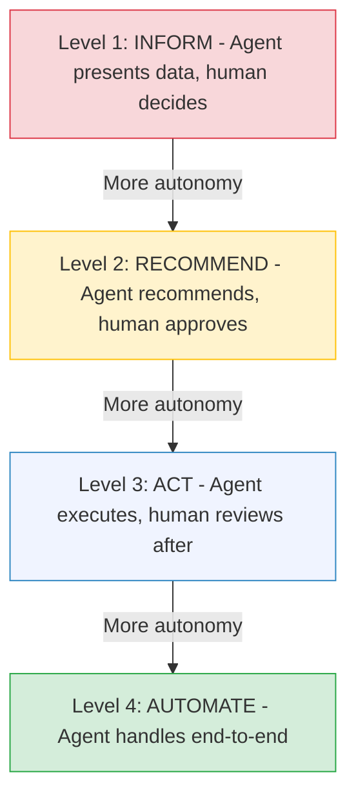
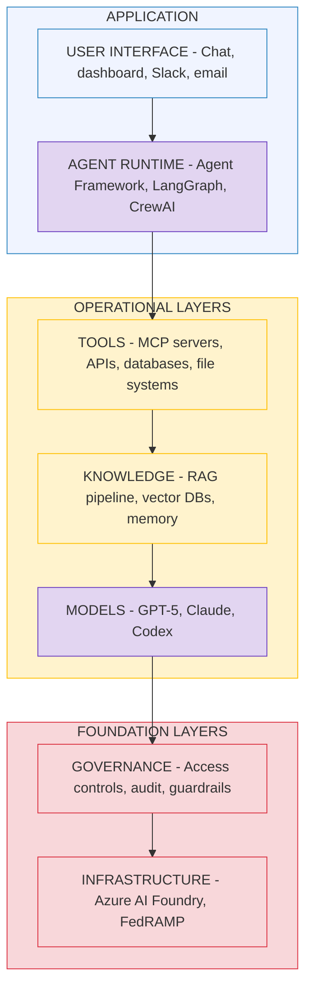

# Agentic AI Fundamentals

## From Chatbots to Agents: The Paradigm Shift

---

## What Is Agentic AI?

Agentic AI refers to AI systems that can **plan, reason, and execute multi-step tasks autonomously** — not just respond to a single prompt. The difference between a chatbot and an agent is the difference between answering a question and completing a job.

**Chatbot interaction:**
```
User:  "What was our Q3 revenue?"
AI:    "$38 million, a 14% increase year-over-year."
       (done — single question, single answer)
```

**Agent interaction:**
```
User:  "Prepare the Q3 board presentation."
Agent: [Thinking] I need to:
       1. Pull Q3 financial data from the data warehouse
       2. Compare against Q2 and last year's Q3
       3. Identify top-performing and underperforming practice areas
       4. Generate charts for revenue, headcount, and utilization
       5. Create presentation slides in the company template
       6. Draft executive summary and talking points
       7. Send to the CFO for review

       [Executing steps 1-6 autonomously...]
       [Pausing at step 7 for human approval]

Agent: "I've prepared the Q3 board deck with 12 slides. Revenue, 
        headcount, and utilization data are current as of today. 
        I've flagged that the Healthcare practice declined 8% QoQ — 
        you may want to address this. Ready to send to the CFO 
        for review. Should I proceed?"
```

---

## The Five Characteristics of Agents

### 1. Goal-Oriented
Agents pursue objectives, not just respond to prompts. They maintain focus on the end goal even when intermediate steps fail or produce unexpected results.

### 2. Multi-Step Reasoning
Agents break complex goals into sub-tasks, plan an execution order, and work through them systematically. This requires planning capabilities that simple chatbots lack.

### 3. Tool-Using
Agents interact with external systems — databases, APIs, file systems, email, calendars — to accomplish real-world tasks. Through protocols like MCP, agents can query data, create files, send messages, and trigger workflows.

### 4. Memory & Context
Agents maintain context across steps and conversations. They remember what they've already done, what the results were, and what comes next. This includes both short-term (current task) and long-term (past interactions) memory.

### 5. Self-Correcting
Agents can evaluate their own outputs and retry when something fails. If a database query returns an error, the agent can reformulate the query. If a generated chart looks wrong, it can regenerate it. This observe-evaluate-adjust loop is what makes agents reliable.

---

## Agent Architecture



---

## Orchestration Patterns

When complex tasks require multiple specialized agents working together, you need orchestration — patterns for coordinating agent activities.

### Pattern 1: Sequential (Pipeline)

Agents execute in a fixed, linear order. Each agent's output becomes the next agent's input.



**When to use:** Clear linear dependencies where each step needs the previous step's output. Document processing pipelines, data transformation workflows.

**AWS analog:** Step Functions with sequential states — each step depends on the output of the previous one.

**Trade-off:** Simple to debug and understand. But if step 2 takes a long time, everything waits.

### Pattern 2: Parallel (Fan-Out / Fan-In)

Multiple agents work independently on different sub-tasks. Results are aggregated when all complete.



**When to use:** Independent sub-tasks that don't depend on each other. Data collection from multiple sources, multi-market analysis.

**AWS analog:** Step Functions with parallel states (fan-out), or multiple Lambda invocations aggregated.

**Trade-off:** Faster overall (parallel execution), but more complex error handling. What happens if one agent fails?

### Pattern 3: Supervisor

A central "supervisor" agent delegates tasks to specialized workers based on the request type.



**When to use:** Diverse query types that require different expertise. A C-suite dashboard where questions could be about finance, HR, clients, or technology — each routed to a specialized agent.

**Trade-off:** Flexible and extensible (add new experts easily). But the supervisor is a single point of failure and the routing logic must be reliable.

### Pattern 4: Handoff

Agents handle different phases of a workflow, passing context at transition points.



**When to use:** Workflow phases that require fundamentally different capabilities. Customer service (intake → investigation → resolution), document review (classify → analyze → summarize).

**Trade-off:** Clear separation of concerns. But handoff points are fragile — context can be lost if not managed carefully.

---

## Human-in-the-Loop: The Non-Negotiable

In enterprise environments — especially in government and financial services — agents should **propose actions, not execute them unilaterally** for high-stakes decisions.

**The trust ladder:**



**The principle:** Start at Level 1. Earn trust through accuracy and reliability. Gradually move up the ladder. Never skip levels for high-stakes operations.

For the C-suite dashboard: the GenAI chat interface should be Level 1-2. It informs and recommends. It should never take actions (sending emails, modifying data, approving budgets) without explicit human authorization.

---

## Agents vs. Traditional Automation

| Dimension | Traditional Automation (RPA, Scripts) | AI Agents |
|---|---|---|
| **Decision making** | Follows fixed rules | Reasons about the best action |
| **Error handling** | Fails on unexpected input | Adapts and retries |
| **Flexibility** | Breaks when UI/API changes | Can interpret changes |
| **Scope** | Single task, single system | Multi-step, multi-system |
| **Setup effort** | High (explicit rules for everything) | Lower (describe the goal) |
| **Predictability** | 100% deterministic | Probabilistic — needs guardrails |
| **Auditability** | Every step logged by design | Requires intentional logging |

**Key insight:** Agents are not a replacement for traditional automation. They're complementary. Use fixed automation for tasks that are well-defined, deterministic, and never change. Use agents for tasks that require judgment, involve variability, or span multiple systems.

---

## The Agentic AI Stack



---

## Key Takeaways

1. **Agents execute workflows, not just queries.** The shift from chatbot to agent is the shift from "answer my question" to "complete this task."

2. **Orchestration patterns are not new.** Sequential, parallel, supervisor, and handoff patterns are the same patterns used in serverless orchestration (Step Functions, Lambda), message queues, and microservices. The agents are smarter, but the architecture is familiar.

3. **Human-in-the-loop is not optional for enterprise.** Start supervised, build trust, gradually expand autonomy. Never let agents make high-stakes decisions without human approval.

4. **Agents need guardrails more than chatbots.** A chatbot that hallucinates gives a bad answer. An agent that hallucinates takes a bad action. The stakes are higher, so the governance must be stronger.

5. **The agent is only as good as its tools.** An agent without access to real data and systems is just a chatbot with extra steps. MCP and tool integration are what make agents useful.
