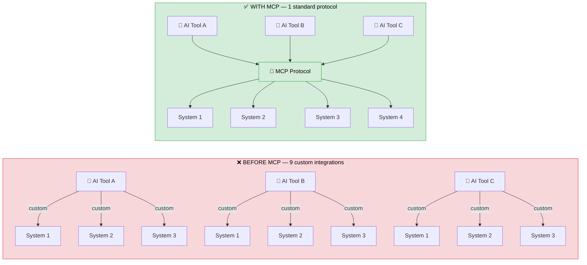
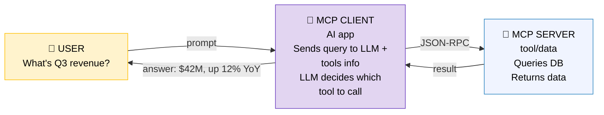

# MCP (Model Context Protocol)

## The Universal Connector for AI

---

## What Is MCP?

The Model Context Protocol (MCP) is an open standard for connecting AI models to external tools and data sources. It was introduced by Anthropic in November 2024 and has since been adopted by OpenAI, Google DeepMind, Microsoft, and others. In December 2025, Anthropic donated MCP to the Agentic AI Foundation under the Linux Foundation.

**The problem MCP solves:** Before MCP, every AI-to-tool connection required custom code. Want the AI to query a database? Write a custom integration. Read a file? Another integration. Call a Salesforce API? Another one. If you had 10 AI tools and 10 enterprise systems, you needed up to 100 custom connectors. This is the "N×M" integration problem.

**MCP's solution:** One standard protocol that both AI tools and enterprise systems speak. Build one MCP server for your database, and every MCP-compatible AI client (Claude, ChatGPT, Copilot, etc.) can use it. Build one MCP client in your AI app, and it can connect to any MCP server.

---

## How MCP Works

MCP uses a client-server architecture built on JSON-RPC 2.0:

**Step by step:**
1. The MCP client tells the LLM what tools are available (via MCP server discovery)
2. User asks a question
3. LLM analyzes the question and decides which tool(s) to call and with what parameters
4. MCP client sends the request to the appropriate MCP server
5. MCP server executes the action (queries DB, calls API, reads file) and returns results
6. MCP client feeds the results back to the LLM
7. LLM generates a response grounded in the tool results

---

## MCP Components

### MCP Server
Exposes specific capabilities to AI models. Examples:
- A **database MCP server** that lets AI query PostgreSQL
- A **file system MCP server** that lets AI read/write files
- A **Salesforce MCP server** that lets AI access CRM data
- A **GitHub MCP server** that lets AI interact with repos and PRs

Each server advertises its **tools** (actions it can perform), **resources** (data it can provide), and **prompts** (pre-built prompt templates).

### MCP Client
The AI application that connects to MCP servers. Built into tools like Claude Desktop, VS Code with Copilot, or your custom AI application.

### Transport Layer
How client and server communicate:
- **STDIO** — local, low-latency (for MCP servers running on the same machine)
- **HTTP with SSE** — remote, for distributed MCP servers
- **JSON-RPC 2.0** — the message format for all communications

---

## MCP in the Enterprise: The Security Challenge

Most MCP servers available today were designed for individual developers. They solve the connectivity problem but ignore the governance problem. For regulated environments (government, finance, healthcare), there are four critical security gaps.

### Gap 1: Access Control
**The problem:** Default MCP connects via a single service account. If one user can access data through MCP, all users effectively can — the AI operates under the same credentials regardless of who's asking.

**The violation:** This directly breaks Zero Trust principles. A junior analyst and a Partner should not have the same data access through the AI.

**The fix:** Per-operation authorization. Every MCP request must verify: this specific user, requesting this specific action, on this specific data, is permitted to proceed.

### Gap 2: Credential Exposure
**The problem:** API keys and tokens stored in configuration files or environment variables. If an attacker can inject a prompt that instructs the AI to reveal its configuration, credentials are exposed.

**The violation:** Prompt injection attacks become credential theft attacks.

**The fix:** Credential isolation. OAuth tokens stored in the OS secure keychain — never in config files, environment variables, or anywhere the AI's context can access.

### Gap 3: Audit Trail
**The problem:** No built-in per-operation logging. Regulators (FedRAMP, HIPAA, PCI-DSS) require traceable records of every data access.

**The violation:** Can't prove to an auditor what the AI accessed, when, and for whom.

**The fix:** Comprehensive audit logging. Every MCP tool call logged to SIEM with metadata: user, timestamp, tool called, parameters, data accessed, result returned.

### Gap 4: Tool Sprawl ("Shadow MCPs")
**The problem:** Anyone can install an MCP server from a public repository. Unauthorized servers enter production without security review — the AI equivalent of shadow IT.

**The violation:** Unvetted code with database access in your production environment.

**The fix:** Trusted MCP server registry. Formal vetting pipeline: security review, dependency analysis, SBOM generation, malware scanning. Only approved, version-pinned servers allowed in production.

---

## Enterprise MCP Requirements

For regulated environments, six requirements are non-negotiable:

| # | Requirement | Description |
|---|---|---|
| 1 | **Per-operation authorization** | Every individual MCP operation verified against user + action + data (not just per-session) |
| 2 | **Credential isolation** | OAuth tokens in OS keychain, never in config files or AI context |
| 3 | **Trusted server registry** | Formal vetting pipeline for all MCP servers before production deployment |
| 4 | **Mandatory containerization** | Each MCP server in isolated container with read-only filesystem, network allowlist, resource quotas |
| 5 | **Comprehensive audit logging** | Every tool call logged to SIEM with full metadata |
| 6 | **Compliance policy enforcement** | Data type policies (HIPAA, PCI-DSS, GDPR) with redaction and retention rules |

---

## MCP in the Microsoft Ecosystem

Microsoft is integrating MCP across its AI platform:

- **GitHub Copilot Enterprise AI Controls** — MCP allowlists at the enterprise level (GA February 2026)
- **Power Platform Dataverse** — New MCP Server transforms Dataverse into an AI-ready backend
- **Microsoft Agent Framework** — Built-in MCP client integration for agent tool access
- **Power Apps MCP** — Agents can parse unstructured data into app forms via MCP

---

## Key Takeaways

1. **MCP is becoming the standard.** With adoption by OpenAI, Google, Microsoft, and Anthropic, it's the de facto protocol for AI-to-system integration.

2. **The protocol is solid; the security layer is the gap.** MCP works well for developers. Making it work for enterprises in regulated industries requires building the governance layer that doesn't exist by default.

3. **This is where infrastructure security experience translates directly.** The same Zero Trust principles applied to cloud security — least privilege, verify everything, log everything — are exactly what MCP needs.

4. **Competitive advantage belongs to teams that figure out secure MCP.** Everyone can build a chatbot. Building AI agents that securely interact with enterprise systems while meeting FedRAMP/HIPAA/PCI-DSS requirements — that's the hard problem and the opportunity.
