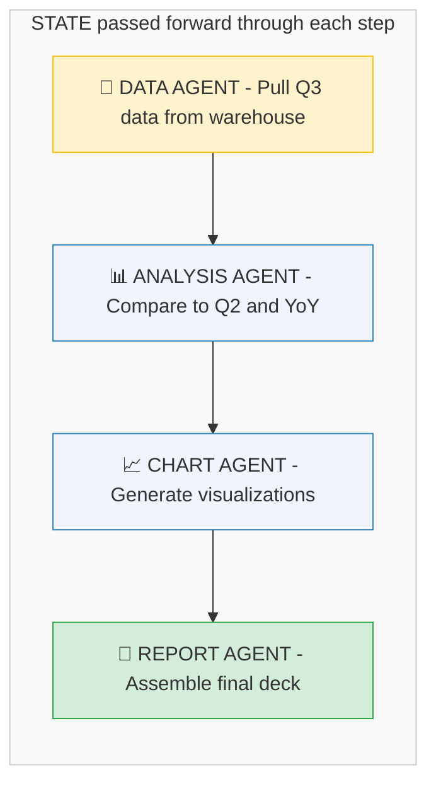
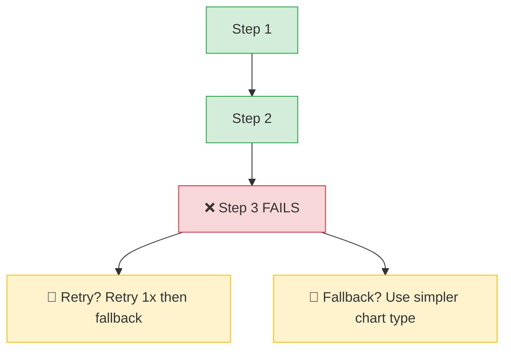
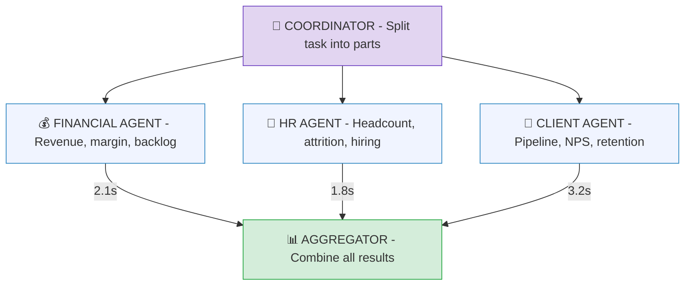
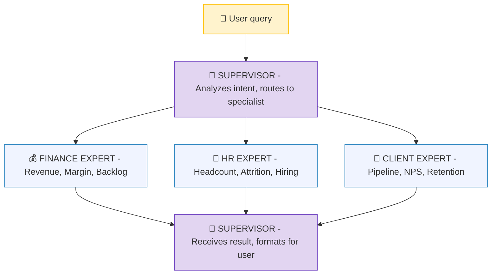
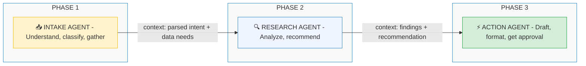
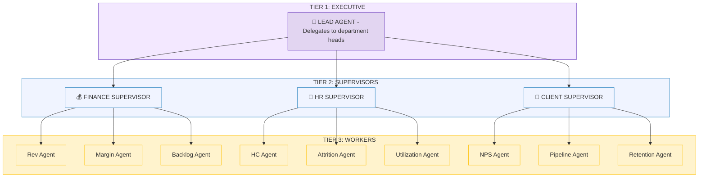
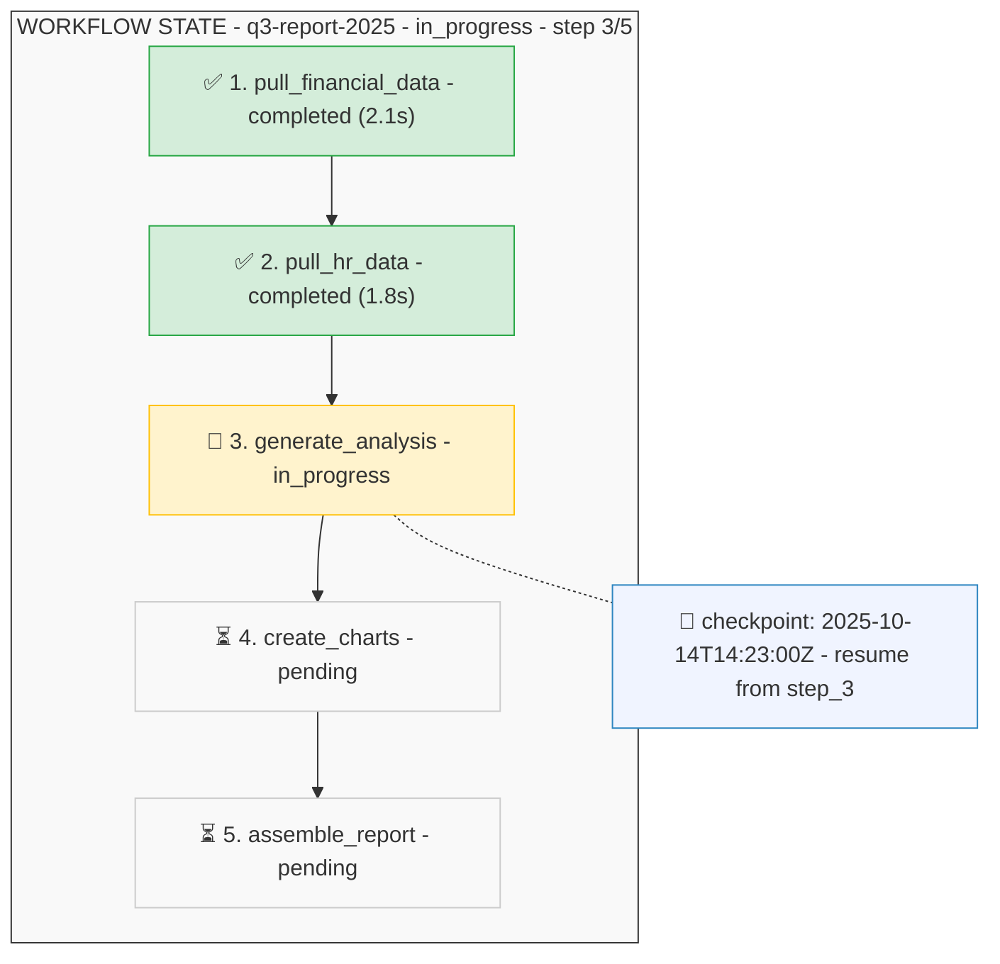
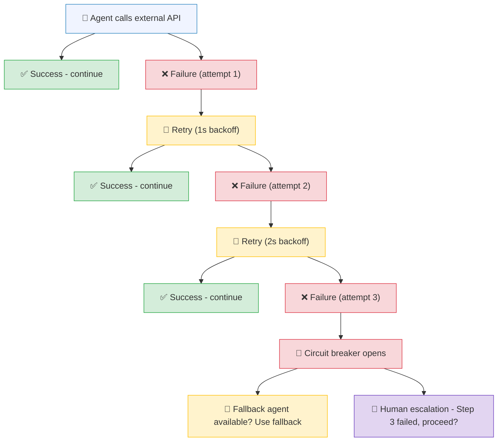

# Agent Orchestration Patterns

## Deep Dive Into Multi-Agent Architectures

---

## Why Orchestration Matters

A single agent can answer a question or execute a simple workflow. But real enterprise tasks require coordination — pulling data from multiple sources, analyzing it with different expertise, assembling a final deliverable, and getting human approval before delivery. This is where orchestration comes in.

**The analogy:** An orchestra doesn't work because each musician is talented. It works because there's a conductor who knows when the strings enter, when the brass swells, and when everyone plays together. Agent orchestration is the conductor for AI workflows.

If you've read [Agentic AI Fundamentals](07-agentic-ai.md), you've seen the four core patterns at a high level. This guide goes deeper — state management, error handling, framework comparison, and the architectural decisions that make or break production agent systems.

---

## Pattern 1: Sequential Pipeline (Deep Dive)

Agents execute in a fixed, linear order. Each agent's output becomes the next agent's input.



### Error Handling in Sequential Pipelines

What happens when Step 3 fails? Three strategies:

| Strategy | How It Works | Best For |
|---|---|---|
| **Retry** | Re-run the failed step with the same input | Transient failures (API timeout, rate limit) |
| **Fallback** | Switch to an alternative approach (e.g., simpler chart type) | When a degraded result is acceptable |
| **Replan** | Go back to an earlier step and try a different path | When the failure reveals a data issue |



**Enterprise principle:** Never silently swallow errors. Every failure must be logged, and the final output must indicate if any step used a fallback. An executive reading a report with degraded charts needs to know.

### When to Use Sequential

- Clear linear dependencies (each step needs the previous output)
- Deterministic workflows (same input always produces same steps)
- Debugging is important (easy to trace through the pipeline)
- Example: quarterly report generation, document processing, ETL pipelines

---

## Pattern 2: Parallel (Fan-Out / Fan-In) Deep Dive

Multiple agents work independently on different sub-tasks. Results are aggregated when all (or enough) complete.



### Handling Partial Failures

In production, some agents will fail while others succeed. The key decision: **do you wait for all agents, or proceed with partial results?**

| Strategy | Behavior | Trade-off |
|---|---|---|
| **Wait all** | Block until every agent completes | Most complete, but one slow agent blocks everything |
| **Wait majority** | Proceed when N of M agents complete | Faster, but may miss data |
| **Timeout + partial** | Set a deadline; use whatever is done | Predictable latency, incomplete data |
| **Best effort** | Return immediately as results arrive | Fastest, but user gets incremental results |

**For the C-suite dashboard:** Timeout + partial is the right choice. An executive waiting for a Q3 overview should get financial and HR data in 5 seconds even if the client agent is slow, rather than waiting 30 seconds for all three.

### When to Use Parallel

- Independent sub-tasks with no dependencies between them
- Latency-sensitive applications (parallel is faster than sequential)
- Multi-source data collection (each source is a separate agent)
- Example: multi-practice data gathering, running the same analysis across regions

---

## Pattern 3: Supervisor (Deep Dive)

A central "supervisor" agent receives every request, analyzes it, and delegates to the right specialized agent.



### The Routing Decision

The supervisor needs to decide which agent to call. Three approaches:

**1. LLM-based routing:** The supervisor uses the LLM to classify the query and pick an agent. Flexible but adds latency.

**2. Rule-based routing:** Keywords or patterns map to agents (e.g., "revenue" → Finance Expert). Fast but brittle.

**3. Embedding-based routing:** Embed the query and compare against agent descriptions. Find the most semantically similar agent. Best of both — fast and flexible.

```
Query: "How is utilization trending?"

Embedding similarity to agent descriptions:
  Finance Expert:  0.71  ("financial metrics, revenue, margins")
  HR Expert:       0.89  ("workforce, headcount, utilization, hiring")  ← winner
  Client Expert:   0.34  ("client satisfaction, pipeline, retention")
```

### Multi-Agent Routing

Some queries need multiple experts. The supervisor can detect this and fan out:

```
Query: "How does utilization relate to revenue decline?"

Supervisor detects: needs both HR data (utilization) and Finance data (revenue)
  → Routes to HR Expert AND Finance Expert (parallel)
  → Aggregates both responses
  → Generates a unified answer connecting utilization to revenue
```

### When to Use Supervisor

- Diverse query types requiring different expertise
- User-facing systems where intent varies widely
- Extensible systems (add new experts without changing the router)
- Example: C-suite dashboard, customer service triage, IT help desk

---

## Pattern 4: Handoff (Deep Dive)

Agents handle different **phases** of a workflow, explicitly passing context at transition points.



### The Handoff Protocol

What gets passed between agents matters enormously. Too little context and the next agent is blind. Too much and you waste tokens.

**Handoff payload structure:**

```
{
  "task_id": "q3-report-2025",
  "phase": "research → action",
  "context": {
    "original_request": "Prepare Q3 board presentation",
    "classification": "executive_reporting",
    "data_collected": { ... },
    "analysis_results": { ... },
    "recommendation": "Focus on Defense growth, flag Health decline"
  },
  "constraints": {
    "deadline": "2025-10-15T09:00:00Z",
    "audience": "Board of Directors",
    "format": "PowerPoint, max 15 slides"
  },
  "history": [
    {"phase": "intake", "agent": "intake-v2", "duration_ms": 1200},
    {"phase": "research", "agent": "research-v3", "duration_ms": 8400}
  ]
}
```

### When to Use Handoff

- Workflow phases that require fundamentally different capabilities
- Long-running processes where different agents specialize in different stages
- Clear phase boundaries (intake → processing → delivery)
- Example: client onboarding, proposal generation, incident response

---

## Pattern 5: Hierarchical (Multi-Level)

A lead agent delegates to department-level supervisors, who each manage their own team of workers. This scales to complex organizations.



**When to use:** Enterprise-scale workflows where the complexity exceeds what a single supervisor can manage. The lead agent never interacts with individual workers — it works through department-level supervisors who each manage their domain.

---

## State Management

Agents need to track where they are, what's been done, and what's next. Without state management, multi-step workflows can't recover from failures or resume after interruptions.

### What State Looks Like



### Checkpointing

For long-running workflows, save state after each step. If the system crashes at Step 4, resume from Step 4's checkpoint instead of starting over.

**Why this matters in enterprise:** A quarterly report generation that takes 10 minutes shouldn't restart from scratch because of a network timeout at minute 8. Checkpointing makes agent workflows production-resilient.

---

## Framework Comparison

| Feature | LangGraph | Microsoft Agent Framework | CrewAI | n8n |
|---|---|---|---|---|
| **Orchestration model** | Directed graph | Event-driven | Role-based crew | Visual workflow |
| **State management** | Built-in (graph state) | External (Cosmos DB) | Shared memory | Node-based |
| **MCP integration** | Via LangChain tools | Native MCP client | Via custom tools | Via connectors |
| **Human-in-the-loop** | Graph breakpoints | Event callbacks | Task delegation | Manual nodes |
| **Complexity** | Medium | High | Low | Low |
| **Enterprise readiness** | Medium | High (Azure ecosystem) | Low | Medium |
| **Best for** | Custom workflows | Azure enterprise shops | Quick prototypes | Non-developers |
| **Learning curve** | Moderate | Steep | Gentle | Gentle |

**For regulated enterprise environments:** Microsoft Agent Framework integrates with Azure AI Foundry, supports FedRAMP compliance, and connects natively to the Microsoft ecosystem. LangGraph offers more flexibility for custom architectures. CrewAI and n8n are best for prototyping and simpler use cases.

---

## Error Handling Patterns

Every agent workflow will encounter failures. The question is how you handle them.

| Pattern | Description | When to Use |
|---|---|---|
| **Retry with backoff** | Try again after 1s, 2s, 4s... | Transient API failures, rate limits |
| **Fallback agent** | Route to an alternative agent | When primary agent is unavailable |
| **Circuit breaker** | Stop calling a failing service after N failures | Prevent cascading failures |
| **Human escalation** | Pause workflow and notify a human | When automated recovery isn't safe |
| **Graceful degradation** | Return partial results with a warning | When some data is better than no data |



---

## Key Takeaways

1. **Choose the pattern that matches your workflow structure.** Sequential for linear dependencies, parallel for independent tasks, supervisor for diverse queries, handoff for phased processes, hierarchical for enterprise scale.

2. **State management is non-negotiable for production.** Without checkpointing and state tracking, any failure means restarting from scratch. Build state management in from day one.

3. **Error handling determines reliability.** The difference between a demo and a production system is what happens when things fail. Implement retry, fallback, and human escalation for every external dependency.

4. **Start with the simplest pattern that works.** A sequential pipeline is easier to debug than a hierarchical multi-agent system. Add complexity only when the workflow demands it.

5. **The framework choice depends on your ecosystem.** Microsoft shops → Agent Framework. Custom architectures → LangGraph. Quick prototypes → CrewAI. Match the tool to your existing infrastructure.

---

### Related Content
- **[Agentic AI Fundamentals](07-agentic-ai.md)** — The four core patterns and human-in-the-loop
- **[MCP (Model Context Protocol)](08-mcp.md)** — How agents connect to tools
- **[Notebook 06 — Build a Simple Agent](../notebooks/06-build-a-simple-agent.ipynb)** — Hands-on agent implementation
