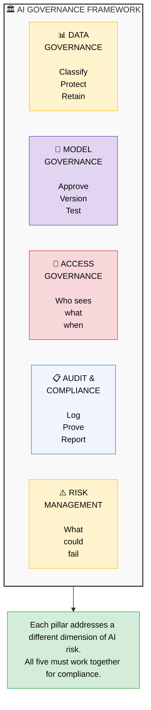
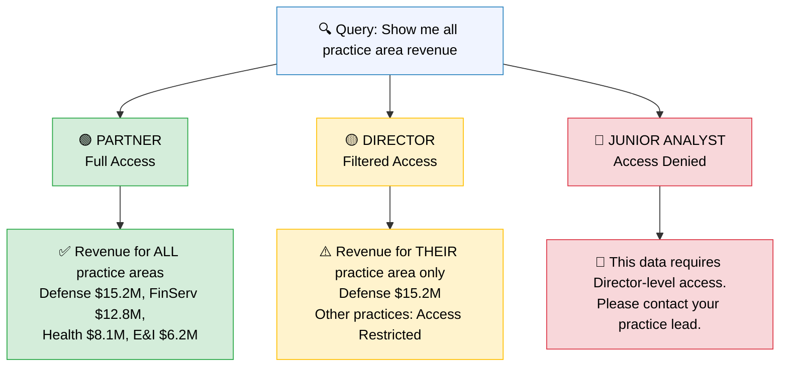
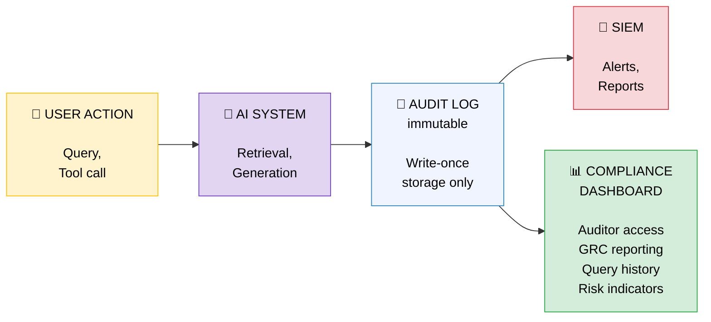

# AI Governance in Regulated Environments

## Building AI That Auditors Can Trust

---

## Why Governance Matters

A Partner walks into your office and asks: "Can we deploy this AI dashboard for our DoD client?" The answer isn't yes or no — it's "yes, if we have the governance framework to prove it's compliant."

In regulated industries — government, healthcare, financial services — the technology is the easy part. The hard part is proving to auditors, regulators, and risk committees that your AI system is safe, fair, traceable, and compliant. Without governance, you don't have a product. You have a liability.

**The analogy:** Governance is the building code for AI systems. Nobody questions whether buildings need building codes. They exist because the consequences of failure are too high. AI systems that make decisions about people's health benefits, financial services, or national security need the same rigor.

---

## The Regulatory Landscape

Different frameworks care about different things. Here's what each requires when AI enters the picture:

| Framework | Scope | Data Residency | Access Controls | Audit Trail | Encryption | Incident Response |
|---|---|---|---|---|---|---|
| **FedRAMP** | US federal data | US-only data centers | Per-user authorization | Every data access logged | At rest + in transit | 24-hour notification |
| **HIPAA** | Protected health info | US (with BAA) | Minimum necessary access | 6-year retention | PHI encrypted always | 60-day notification |
| **PCI-DSS** | Payment card data | Varies by level | Role-based, least privilege | 1-year retention | Strong cryptography | Immediate containment |
| **SOC 2** | Service organizations | Per trust criteria | Logical access controls | Continuous monitoring | Per trust criteria | Defined response plan |
| **GDPR** | EU personal data | EU/EEA (or adequacy) | Purpose limitation | DPO oversight | Pseudonymization | 72-hour notification |

**The AI-specific challenge:** These frameworks were written for traditional IT systems. They assume data flows through deterministic software — input A always produces output B. AI is probabilistic. The same question asked twice might produce different answers. This introduces a new category of risk that existing frameworks don't fully address, and your governance framework must bridge that gap.

---

## The AI Governance Framework: Five Pillars

---

### Pillar 1: Data Governance

**What it covers:** Classifying, protecting, and managing the data that flows into and out of AI systems.

**Data classification for AI:**

| Classification | Examples | AI Treatment |
|---|---|---|
| **Public** | Published reports, marketing materials | Can be used freely in AI context |
| **Internal** | Internal memos, org charts | Accessible to authenticated employees only |
| **Confidential** | Financial data, client details | Role-based access, audit logged |
| **Restricted** | PII, PHI, classified data | Encrypted, masked in prompts, never cached |

**For RAG pipelines specifically:**
- **Data lineage:** Every chunk in the vector database must trace back to its source document, with metadata on who created it, when, and what classification it carries.
- **Retention policies:** Vectors must be deletable when source documents expire. If a client contract ends, all related vectors must be purged — not just the source files.
- **PII handling:** Names, SSNs, account numbers should be redacted before embedding. The vector database should never contain raw PII that could be retrieved and displayed.

---

### Pillar 2: Model Governance

**What it covers:** Which AI models are approved for use, how they're tested, and how changes are managed.

**The approved model registry:**
Not every model can be used in every context. A governance framework defines which models are approved for which data classifications:

| Data Classification | Approved Models | Rationale |
|---|---|---|
| **Public/Internal** | GPT-4o, Claude, Gemini (cloud) | Standard cloud APIs acceptable |
| **Confidential** | Azure OpenAI (dedicated), Claude on AWS | Enterprise SLAs, data isolation |
| **Restricted** | Self-hosted open-source (Llama, Mistral) | No data leaves the network boundary |

**Version control:** When OpenAI updates GPT-4o, your system's behavior may change. Model governance requires:
- Pinned model versions in production
- Testing before version upgrades
- Rollback capability if a new version degrades quality

**Testing requirements:** Before any model reaches production:
- Accuracy benchmarks on representative queries
- Hallucination rate measurement
- Bias testing on protected categories
- Latency and cost profiling

---

### Pillar 3: Access Governance

**What it covers:** Who can access what through the AI system, and under what conditions.

In a traditional application, access controls are straightforward — users have roles, roles have permissions. AI adds a complication: the AI itself has access to data, and it mediates between users and that data. A junior analyst asking the AI dashboard a question should not receive the same data as a Partner.

**The tiered access model:**

**Implementation:** Per-operation authorization through the MCP layer. Every query carries the user's identity token. The RAG retrieval pipeline filters results based on the user's clearance level. The system prompt includes role-specific constraints. See [MCP Security for Enterprise](11-mcp-security.md) for the technical architecture.

---

### Pillar 4: Audit and Compliance

**What it covers:** Logging every AI interaction so regulators can trace what happened, when, and why.

**What to log (minimum for FedRAMP/HIPAA compliance):**

| Field | Description | Retention |
|---|---|---|
| **Timestamp** | When the interaction occurred | Per framework (1-6 years) |
| **User identity** | Who asked the question (verified, not self-reported) | Same |
| **Query text** | The exact question asked | Same |
| **Retrieved context** | Which chunks/documents were retrieved | Same |
| **Data sources accessed** | Which MCP servers/databases were queried | Same |
| **Model used** | Which LLM processed the request (including version) | Same |
| **Response text** | The exact answer generated | Same |
| **Access decisions** | What data was filtered out due to access controls | Same |
| **Latency** | How long the request took | Same |

**The audit pipeline:**

**Critical requirement:** Audit logs must be **immutable**. Once written, they cannot be modified or deleted (even by administrators). Use write-once storage (Azure Immutable Blob, AWS S3 Object Lock) to prevent tampering.

---

### Pillar 5: Risk Management

**What it covers:** Identifying what can go wrong with AI systems and planning for it.

**AI-specific risk matrix:**

| Risk | Likelihood | Impact | Mitigation |
|---|---|---|---|
| **Hallucination in financial report** | Medium | High (bad decisions) | Guardrails, source citations, human review |
| **PII exposure in response** | Low | Critical (regulatory fine) | Output scanning, PII redaction, access controls |
| **Model bias in HR queries** | Medium | High (discrimination) | Bias testing, diverse eval sets, human oversight |
| **Prompt injection via documents** | Medium | High (data exfiltration) | Input sanitization, trusted source registry |
| **Service outage during board meeting** | Low | Medium (embarrassment) | Fallback systems, cached responses, SLAs |
| **Stale data in RAG pipeline** | High | Medium (wrong answers) | Freshness monitoring, timestamp display |

**Human-in-the-loop requirements:**
For regulated environments, certain AI actions must **always** require human approval:
- Any action that modifies data (not just reads it)
- Responses that include financial figures shared externally
- Any output that will appear in regulatory filings
- Recommendations that affect personnel decisions

See [Agentic AI Fundamentals — The Trust Ladder](07-agentic-ai.md) for the framework on graduated autonomy.

---

## Implementation Roadmap

Don't try to build everything at once. A phased approach lets you show progress while building toward full compliance.

### Phase 1: Foundation (Weeks 1-4)
- Deploy audit logging for all AI interactions
- Implement role-based access controls (minimum 3 tiers)
- Establish model inventory (which models, which data, which users)
- Create incident response playbook for AI failures

### Phase 2: Classification (Weeks 5-8)
- Complete data classification for all RAG sources
- Implement PII detection and redaction in the ingestion pipeline
- Build the approved model registry with testing requirements
- Deploy immutable audit log storage

### Phase 3: Automation (Weeks 9-12)
- Automated compliance checks (e.g., "is this response compliant?")
- Continuous monitoring dashboards for model quality and drift
- Automated data freshness monitoring for RAG pipelines
- Integration with existing GRC (Governance, Risk, Compliance) tools

---

## Key Takeaways

1. **Governance is not optional in regulated environments — it's the price of admission.** Without audit trails, access controls, and data classification, your AI system cannot be deployed for government, healthcare, or financial services clients.

2. **Existing frameworks (FedRAMP, HIPAA, PCI-DSS) apply to AI, but don't fully cover it.** The probabilistic nature of AI introduces risks that deterministic compliance frameworks weren't designed for. Your governance framework must bridge that gap.

3. **The five pillars work together.** Data governance feeds model governance (which data can this model see?). Access governance feeds audit (who accessed what?). Risk management drives all of them.

4. **Start with logging.** If you do nothing else, log every AI interaction with full metadata. You can add controls later, but you can never go back and recreate audit trails that don't exist.

5. **Human-in-the-loop is a governance requirement, not just a best practice.** For high-stakes outputs, human review is what regulators want to see. Build it in from day one.

---

### Related Content
- **[MCP Security for Enterprise](11-mcp-security.md)** — Technical security architecture for AI tooling
- **[Context Risks and Mitigations](12-context-risks.md)** — What can go wrong with context and how to prevent it
- **[Agentic AI Fundamentals](07-agentic-ai.md)** — Human-in-the-loop and the trust ladder
