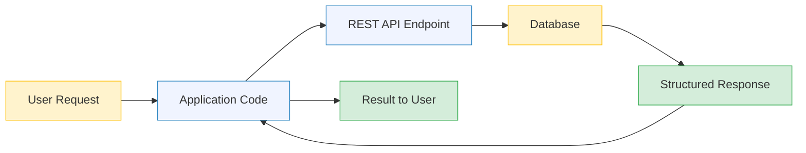
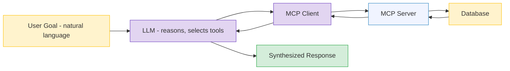
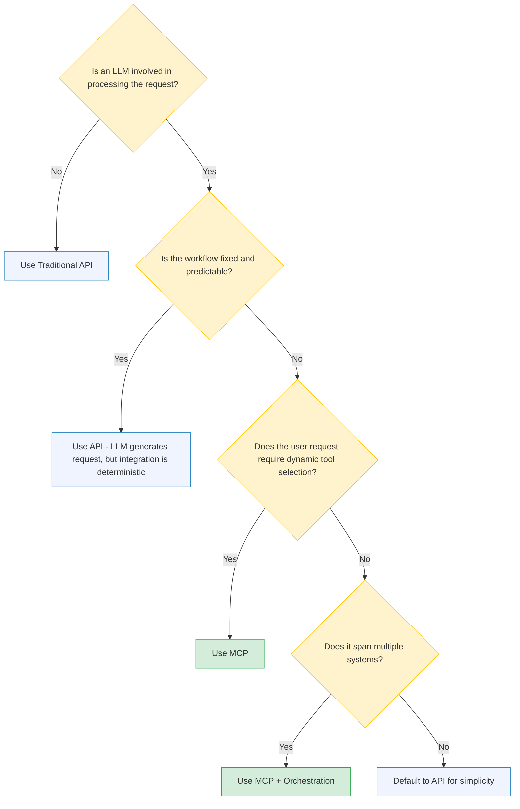
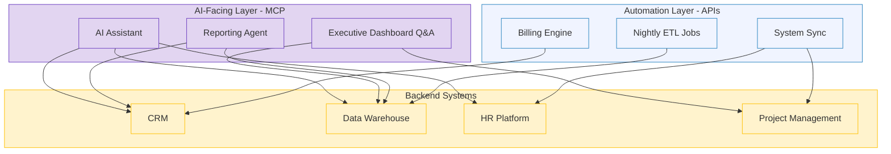

# MCP vs API
## When to Use Which — An Enterprise Decision Framework

---

## The Question Every Platform Team Faces

CorpX's platform team gets the mandate: "Connect everything to AI." They have 15 internal systems — CRM, data warehouse, HR platform, project management, billing, and more. The team has spent years building REST APIs for these systems. Now someone asks:

> "Should we build MCP servers or just use our existing APIs?"

The answer isn't one or the other. It depends on **who is calling** and **why**.

**The core distinction:** APIs are designed for **application-to-application** communication where a developer writes the integration logic. MCP is designed for **AI-to-application** communication where the **model** decides what to call and when.

That single difference — who makes the routing decision — drives every architectural trade-off that follows.

---

## The Analogy: Two Ways to Order Dinner

**Traditional API** = A restaurant with a fixed menu. You (the developer) read the menu (API docs), pick a dish (endpoint), place the order (HTTP request), and get exactly what you asked for. You must know the menu before you order.

**MCP** = A restaurant with a personal chef. You tell the chef what kind of meal you want ("something light with seasonal ingredients"), and the chef decides which ingredients to pull, which techniques to use, and assembles the dish. The chef discovers the kitchen's capabilities dynamically.

The key difference: **who makes the routing decision**. With APIs, the developer decides. With MCP, the model decides.

---

## How Each Approach Works

### Traditional API Flow

The developer controls the integration. Every endpoint, parameter, and error handler is explicitly coded.

The developer wrote the code that calls `/api/v2/revenue?quarter=Q3`. The application knows exactly which endpoint to hit before the user even clicks the button.

### MCP Flow

The model controls the integration. It discovers available tools, reasons about which ones to use, and chains calls dynamically.

The user asked "How did Q3 revenue compare to last year?" The LLM discovered it has access to a financial data tool, decided to call it with the right parameters, and synthesized the response.

---

## Side-by-Side Comparison

| Dimension | Traditional API | MCP |
|---|---|---|
| **Who decides what to call** | Developer (hardcoded logic) | LLM (dynamic tool selection) |
| **Discovery** | Read docs, write code | Model discovers tools at runtime |
| **Input format** | Structured (JSON, query params) | Natural language goal |
| **Output format** | Structured (JSON schema) | LLM-synthesized natural language |
| **Error handling** | HTTP status codes, try/catch | Model interprets failures, retries or replans |
| **When logic changes** | Redeploy application code | Update prompt or tool descriptions |
| **Latency** | Milliseconds (direct call) | Seconds (LLM reasoning + tool call) |
| **Determinism** | High (same input = same call) | Lower (model may choose different tools) |
| **Audit trail** | Application logs | Requires MCP logging layer ([see doc 11](11-mcp-security.md)) |
| **Best for** | App-to-app automation | AI-to-app interaction |

---

## When Traditional APIs Win

### 1. Deterministic, High-Volume Automation

When you know exactly what to call every time, introducing an LLM adds latency and cost without benefit.

**CorpX example:** The nightly data sync between SAP and the data warehouse processes 50,000 financial records. The workflow never changes — extract, transform, load. This should never go through MCP. A scheduled API call runs in minutes. Adding LLM reasoning would take hours and cost thousands in inference.

### 2. Sub-Second Latency Requirements

MCP adds LLM inference time (1-5 seconds per call). APIs respond in milliseconds.

**CorpX example:** The real-time billing engine validates client charges as consultants log hours. Each validation must complete in under 200ms. An LLM in the loop would make the system unusable.

### 3. Cost-Sensitive High-Throughput Operations

Each MCP call includes LLM inference cost. At scale, direct API calls are orders of magnitude cheaper.

**CorpX example:** Processing 100,000 invoices per month through an LLM at $0.01 per call = $1,000/month. The same direct API calls cost pennies.

---

## When MCP Wins

### 1. Dynamic, Unstructured User Requests

When you cannot predict what the user will ask, hardcoding API calls is impossible.

**CorpX example:** The internal AI assistant fields questions from 600 employees. One asks "What's our headcount in APAC?" — that's the HR system. Another asks "Show me the top 5 clients by revenue" — that's the CRM. A third asks "What's the utilization rate for the Digital practice?" — that's the project management tool. The AI discovers and selects from dozens of tools dynamically via MCP. No developer could anticipate and hardcode every possible question.

### 2. Multi-System Orchestration from Natural Language

When a single user request touches multiple systems, MCP lets the agent chain calls from one instruction.

**CorpX example:** "Onboard the new client Acme Corp" requires: (1) create a record in CRM, (2) provision a project workspace, (3) notify the staffing team via HR system, (4) update the capacity planning tool. One sentence, four systems. With MCP, the agent discovers all four tools and orchestrates them. With APIs, a developer would need to build and maintain that specific workflow.

### 3. Reducing the Integration Maintenance Burden

Without MCP, connecting N AI applications to M backend systems requires N x M custom integrations. With MCP, you maintain N + M standardized connections.

**CorpX example:** 3 AI tools (assistant, dashboard, reporting agent) connecting to 5 backend systems. Without MCP: 15 custom integrations to build and maintain. With MCP: 3 clients + 5 servers = 8 standardized components. See the [full N x M breakdown in doc 08](08-mcp.md).

---

## The Decision Framework

When CorpX's architecture team evaluates a new integration, they follow this decision tree:

The rule of thumb: **if a developer can hardcode the integration and it rarely changes, use an API. If an LLM needs to figure out what to call at runtime, use MCP.**

---

## The Hybrid Reality

Most enterprises won't choose one or the other. They'll use both — for different layers of the same architecture.

The AI-facing layer connects through MCP — dynamic, natural-language-driven, model-controlled. The automation layer connects through traditional APIs — deterministic, scheduled, developer-controlled. Both layers hit the same backend systems.

**The secondary analogy:** APIs are the roads. MCP is the GPS. You need both — roads to move data and GPS to figure out which roads to take.

---

## Key Takeaways

1. **MCP and APIs solve different problems.** APIs connect applications to applications. MCP connects AI models to applications. The choice depends on who makes the routing decision — developer or model.

2. **Use APIs when the workflow is fixed.** If a developer can hardcode the integration logic and it rarely changes, an API is simpler, faster, and cheaper.

3. **Use MCP when the user drives the interaction.** If an LLM needs to dynamically discover and select tools based on unpredictable natural-language requests, MCP is the right protocol.

4. **Most enterprises will use both.** The AI-facing layer uses MCP. The automation layer uses APIs. They coexist, connecting to the same backend systems for different purposes.

5. **MCP does not replace your API strategy — it extends it.** Your existing APIs become the backend that MCP servers wrap. Good API design makes good MCP servers possible.

---

### Related Content

- **[MCP (Model Context Protocol)](08-mcp.md)** — What MCP is and how it works
- **[MCP Security for Enterprise](11-mcp-security.md)** — Security gaps and Zero Trust patterns for AI tooling
- **[Agent Orchestration Patterns](09-orchestration-patterns.md)** — Multi-agent architectures that use MCP
- **[Agentic AI Fundamentals](07-agentic-ai.md)** — The agent paradigm that MCP enables
