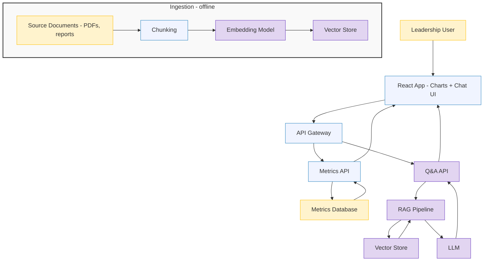
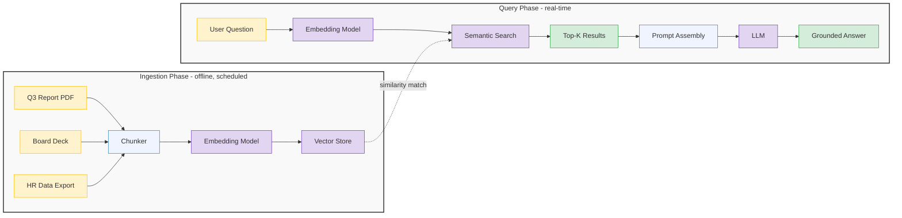
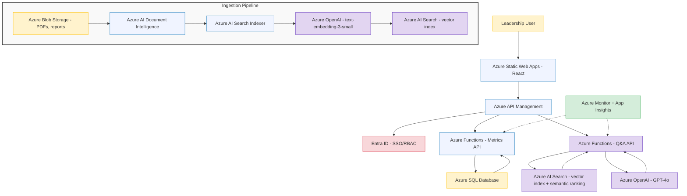
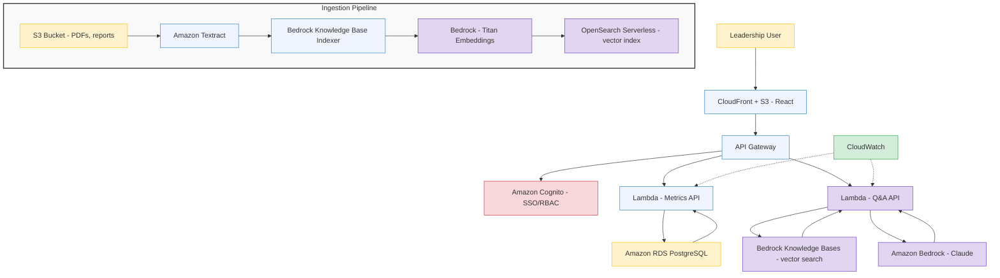

# AI-Powered Metrics Dashboard
## End-to-End Architecture on Azure and AWS

---

## The Use Case

CorpX leadership wants a dashboard. Not just any dashboard — one that shows revenue, utilization, headcount, and attrition in real-time charts, **and** lets executives ask questions about the data in natural language.

Two capabilities in one application:

1. **Traditional metrics visualization** — React app rendering charts from a database. Standard engineering.
2. **GenAI-powered Q&A** — A conversational interface where leadership types "Why did Q3 revenue drop?" and gets an AI-generated answer grounded in CorpX's actual data.

The first part is familiar. The second part is where RAG, embeddings, vector search, and LLMs come together in a production architecture.

This guide walks through the conceptual architecture (cloud-agnostic), then maps it to specific services on **Azure** and **AWS**.

---

## The Building Blocks

Before choosing cloud services, understand what capabilities the application needs:

| Capability | Purpose | Why It's Needed |
|---|---|---|
| **Frontend** | React app with charts + chat interface | Users interact here |
| **API Layer** | Backend endpoints for metrics + Q&A | Routes requests, enforces auth |
| **Metrics Database** | Structured storage for KPIs | Powers the charts and dashboards |
| **Document Storage** | PDFs, reports, slide decks | Source material for AI to reference |
| **RAG Pipeline** | Chunking, embedding, vector search | Retrieves relevant context for each question |
| **LLM** | Natural language generation | Produces the AI-generated answers |
| **Embedding Model** | Converts text to vectors | Enables semantic search across documents |
| **Authentication** | SSO, role-based access | Ensures only authorized users see data |
| **Monitoring** | Logs, performance, cost tracking | Keeps the system healthy in production |

---

## Conceptual Architecture

This is the cloud-agnostic logical view. Every implementation — Azure, AWS, or otherwise — follows this pattern.

Two paths through the system:
- **Left path (metrics):** User opens the dashboard → React renders charts → API queries the database → structured data flows back to the charts. Standard web app.
- **Right path (Q&A):** User types a question → API routes to the RAG pipeline → query is embedded → vector store finds relevant document chunks → chunks are assembled into a prompt → LLM generates a grounded answer.

---

## The RAG Pipeline — Process Flow

The RAG pipeline has two phases. The ingestion phase runs offline (daily or on-demand). The query phase runs in real-time when a user asks a question. For a deep dive into each component, see [RAG Deep Dive (doc 04)](04-rag-deep-dive.md).

**What happens when a leader asks "Why did Q3 revenue drop?":**
1. The question is converted to a vector using the same embedding model that indexed the documents
2. Vector store finds the most similar document chunks (e.g., paragraphs from the Q3 financial report mentioning revenue trends)
3. Those chunks are inserted into a prompt with guardrails: "Answer based only on the provided context. If the data doesn't support an answer, say so."
4. The LLM generates a response grounded in CorpX's actual data — not hallucinated generalities

---

## Azure Architecture

### Azure Service Mapping

| Component | Azure Service | Why This Service |
|---|---|---|
| **Frontend** | Azure Static Web Apps | Built-in CI/CD from GitHub, custom domains, free tier available |
| **API Layer** | Azure Functions (serverless) | Pay-per-execution, auto-scales, integrates with API Management |
| **API Gateway** | Azure API Management | Rate limiting, auth integration, request routing |
| **Auth** | Microsoft Entra ID | Enterprise SSO, RBAC, conditional access policies |
| **Metrics DB** | Azure SQL Database | Relational queries for structured KPI data, familiar SQL |
| **Doc Storage** | Azure Blob Storage | Cost-effective storage for PDFs and reports |
| **Doc Processing** | Azure AI Document Intelligence | Extracts text from PDFs, tables, forms — handles complex layouts |
| **Vector Search** | Azure AI Search | Built-in vector indexing, semantic ranking, hybrid search |
| **Embeddings** | Azure OpenAI (text-embedding-3-small) | High-quality embeddings, stays within Azure compliance boundary |
| **LLM** | Azure OpenAI (GPT-4o) | Enterprise-grade, data stays in your Azure tenant |
| **Monitoring** | Azure Monitor + App Insights | End-to-end tracing, cost alerts, performance dashboards |

**Azure advantage:** If CorpX is already a Microsoft shop (M365, Entra ID, Azure subscriptions), this architecture keeps everything within one compliance boundary. Azure OpenAI ensures data never leaves the tenant — critical for regulated environments.

---

## AWS Architecture

### AWS Service Mapping

| Component | AWS Service | Why This Service |
|---|---|---|
| **Frontend** | S3 + CloudFront | Static hosting with global CDN, cost-effective at scale |
| **API Layer** | Lambda (serverless) | Pay-per-invocation, auto-scales, no server management |
| **API Gateway** | Amazon API Gateway | Request routing, throttling, auth integration |
| **Auth** | Amazon Cognito | User pools, federated identity, RBAC support |
| **Metrics DB** | Amazon RDS (PostgreSQL) | Relational queries for structured KPI data, open-source engine |
| **Doc Storage** | S3 | Industry-standard object storage for documents |
| **Doc Processing** | Amazon Textract | OCR and table extraction from PDFs and scanned documents |
| **Vector Search** | OpenSearch Serverless | Managed vector index via Bedrock Knowledge Bases |
| **Embeddings** | Bedrock (Titan Embeddings v2) | Native AWS embedding model, no data leaves AWS |
| **LLM** | Amazon Bedrock (Claude) | Multiple model choices, data stays in AWS, pay-per-token |
| **Monitoring** | CloudWatch | Centralized logging, metrics, alarms |

**AWS advantage:** Bedrock Knowledge Bases handles the entire RAG pipeline (ingestion, chunking, embedding, vector storage, retrieval) as a managed service. Less infrastructure to build. Model choice flexibility — switch between Claude, Titan, Llama, or Mistral without changing architecture.

---

## Azure vs AWS — Quick Comparison

| Component | Azure | AWS | Notes |
|---|---|---|---|
| **Frontend hosting** | Static Web Apps | S3 + CloudFront | Azure has built-in GitHub CI/CD; AWS is more configurable |
| **Serverless compute** | Azure Functions | Lambda | Equivalent capabilities |
| **Auth/SSO** | Entra ID | Cognito | Entra ID is stronger for Microsoft-heavy orgs |
| **Metrics DB** | Azure SQL | RDS PostgreSQL | Both work; choose based on team expertise |
| **Vector search** | Azure AI Search | OpenSearch Serverless | AI Search has built-in semantic ranking; OpenSearch is more flexible |
| **RAG pipeline** | Manual (AI Search + custom code) | Bedrock Knowledge Bases (managed) | AWS is more turnkey; Azure offers more control |
| **Embeddings** | Azure OpenAI | Bedrock Titan | Both are high quality; Azure keeps OpenAI models in-tenant |
| **LLM** | Azure OpenAI (GPT-4o) | Bedrock (Claude, Titan, etc.) | Azure = one model provider; AWS = multi-model marketplace |
| **Doc processing** | AI Document Intelligence | Textract | Both handle PDFs; Azure is stronger on complex form layouts |
| **Monitoring** | Monitor + App Insights | CloudWatch | App Insights has richer tracing for distributed systems |

**The bottom line:** Choose Azure if your organization is already in the Microsoft ecosystem (M365, Entra ID, Azure subscriptions). Choose AWS if you want managed RAG (Bedrock Knowledge Bases) or multi-model flexibility. Both architectures achieve the same outcome.

---

## Key Takeaways

1. **The AI-powered dashboard is two systems in one.** The metrics side is a standard web app (React + API + database). The Q&A side adds a RAG pipeline, vector store, and LLM. Both share the same frontend and API gateway.

2. **RAG is what grounds the AI in your data.** Without it, the LLM would answer based on general training data. With it, responses are anchored to CorpX's actual reports, financials, and HR data.

3. **The architecture is the same on both clouds — only the service names change.** React → API Gateway → serverless functions → vector search → LLM. The logical pattern is cloud-agnostic.

4. **Choose your cloud based on your existing ecosystem.** Microsoft shop? Azure keeps everything in one compliance boundary. AWS shop? Bedrock Knowledge Bases handles the RAG pipeline as a managed service.

5. **Start simple, add complexity later.** Version 1 can be a React app with a single Azure Function calling Azure OpenAI directly (no RAG). Add the vector search layer when you need grounded answers across many documents.

---

### Related Content

- **[RAG Deep Dive](04-rag-deep-dive.md)** — The full RAG pipeline: chunking, embeddings, vector search, reranking
- **[RAG vs Long Context](05-rag-vs-long-context.md)** — When to use RAG vs feeding everything into the context window
- **[Agentic AI Fundamentals](07-agentic-ai.md)** — Adding agent capabilities to the dashboard (tool use, multi-step reasoning)
- **[MCP (Model Context Protocol)](08-mcp.md)** — Connecting the AI to live data sources beyond static documents
- **[MCP vs API](13-mcp-vs-api.md)** — When to use MCP and when traditional APIs are the better choice
