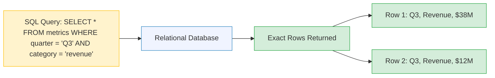
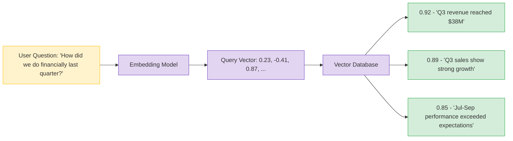
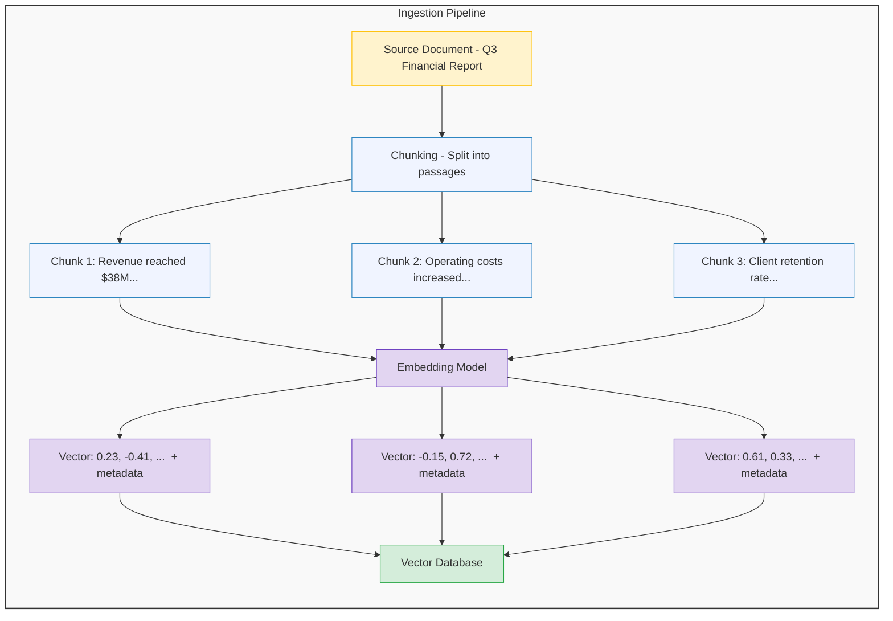
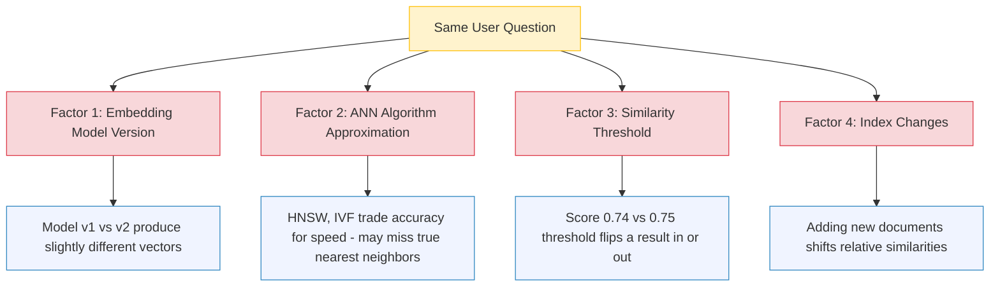

# Vector Databases — How They Work and Why They're Different
## From SQL Queries to Similarity Search

---

## The Core Difference

Traditional databases and vector databases solve fundamentally different problems.

A **traditional database** (PostgreSQL, SQL Server, DynamoDB) stores structured data in rows and columns. You query with exact conditions: `WHERE revenue > 100000 AND quarter = 'Q3'`. The answer is deterministic — same query, same results, every time.

A **vector database** (Pinecone, ChromaDB, Azure AI Search, Weaviate) stores high-dimensional numerical vectors that represent the *meaning* of text, images, or other data. You query by similarity: "find me things that mean something like this." The answer is probabilistic — results are ranked by how close they are in vector space, and small changes can shift rankings.

This distinction matters because **every RAG pipeline depends on a vector database**. If the vector DB returns the wrong context, the LLM generates a confident but incorrect answer. Understanding how retrieval works — and how it fails — is essential for building reliable AI systems.

---

## How a Traditional Database Works

You already know this, but it's worth making explicit because the contrast matters.



**Properties of traditional queries:**
- **Deterministic** — Same query always returns the same rows
- **Exact matching** — Rows either match the condition or they don't
- **Schema-dependent** — You must know the column names and data types
- **Binary results** — A row is either in the result set or it isn't

This works perfectly for structured data. But it breaks down when users ask questions in natural language: *"How did we do financially last quarter?"*

---

## How a Vector Database Works

A vector database stores **embeddings** — arrays of numbers that capture the semantic meaning of text. When you search, you're asking: "find vectors that are close to this one in high-dimensional space."



**Properties of vector queries:**
- **Non-deterministic in practice** — Results can shift (more on this below)
- **Similarity-based** — Every document has a similarity score, nothing is purely in or out
- **Schema-free** — You search by meaning, not column names
- **Ranked results** — Top-K closest vectors, ordered by similarity score

---

## Side-by-Side Comparison

| Dimension | Traditional Database | Vector Database |
|---|---|---|
| **What it stores** | Rows and columns (structured data) | Vectors (numerical representations of meaning) |
| **How you query** | SQL with exact conditions | Semantic similarity ("find things like this") |
| **Result type** | Exact matches (binary: in or out) | Ranked by similarity score (0.0 to 1.0) |
| **Determinism** | Fully deterministic | Non-deterministic in practice |
| **Schema** | Required (tables, columns, types) | Optional (metadata alongside vectors) |
| **Best for** | Structured data, exact lookups, aggregations | Unstructured text, natural language search, AI/RAG |
| **Example query** | `WHERE revenue > 100000` | "How is our financial performance?" |
| **Handles synonyms?** | No — "revenue" won't match "sales" | Yes — semantically similar terms match |
| **Scale** | Billions of rows, millisecond lookups | Millions to billions of vectors, varies by implementation |

---

## How Data Gets Into a Vector Database

The ingestion pipeline converts raw documents into searchable vectors:



Each vector is stored alongside **metadata** — source document, category, date, page number. This metadata enables filtering during search (e.g., "only search Q3 financial documents").

For a deep dive into chunking strategies and their impact on retrieval quality, see [Chunking Strategies (notebook 03)](../notebooks/03-chunking-strategies.ipynb).

---

## Similarity Metrics — How "Close" is Measured

When you search a vector database, it computes how similar your query vector is to every stored vector. Three common metrics:

### Cosine Similarity
Measures the **angle** between two vectors. Ignores magnitude (length), focuses on direction. Most common for text embeddings.
- Range: -1 (opposite) to 1 (identical)
- Best for: Text search, where the direction of meaning matters more than the length of the text

### Euclidean Distance (L2)
Measures the **straight-line distance** between two points in vector space. Smaller = more similar.
- Range: 0 (identical) to infinity
- Best for: When magnitude matters (e.g., image embeddings)

### Dot Product
Measures both **direction and magnitude**. Combines the angle and length of vectors.
- Range: -infinity to infinity (higher = more similar)
- Best for: When embedding magnitude carries meaning (e.g., importance or confidence)

**In practice, cosine similarity is the default for text-based RAG systems.** Most embedding models normalize their outputs, which makes cosine similarity and dot product equivalent.

---

## Deterministic vs Non-Deterministic Retrieval

This is where things get important for production AI systems.

### SQL is Deterministic

```
SELECT * FROM reports WHERE quarter = 'Q3' AND category = 'financial'
```

Run this query a million times. You get the same rows every time. Add a new row to the table? Only that new row might appear in results — existing results don't shift.

### Vector Search is Non-Deterministic in Practice

The same natural language query can return different results depending on:



**Why this matters:** In a traditional dashboard, the number is the number — $38M revenue, every time. In an AI-powered Q&A, the same question might get slightly different supporting context, which leads to slightly different AI-generated answers. Users notice this. Leadership especially notices this.

### Approximate Nearest Neighbor (ANN) Algorithms

Real vector databases don't compare your query against every single stored vector (that would be too slow at scale). Instead, they use **approximate** algorithms:

- **HNSW (Hierarchical Navigable Small World)** — Builds a graph structure for fast traversal. Used by Pinecone, Weaviate, pgvector.
- **IVF (Inverted File Index)** — Partitions vectors into clusters, only searches nearby clusters. Used by FAISS, some Azure AI Search configs.
- **Product Quantization** — Compresses vectors to reduce memory. Trades precision for scale.

The word "approximate" is the key — these algorithms are fast but may **miss the true nearest neighbor** in exchange for millisecond latency. For most RAG use cases, this tradeoff is acceptable. But you should know it exists.

---

## When Retrieval Goes Wrong

The LLM trusts whatever context it receives. If the vector database returns the wrong chunks, the LLM generates a confident but incorrect answer. Three common failure modes:

### 1. Ambiguous Queries

**Query:** *"How are we doing?"*

This is too vague. The embedding captures a general sentiment but no specific topic. The vector DB returns a random mix — some financial data, some HR data, some client data. The LLM tries to synthesize all of it into a coherent answer and produces something vague or misleading.

**Fix:** Query transformation — rephrase vague queries into specific sub-queries, or ask the user to clarify.

### 2. Outdated Context

**Query:** *"What's our current revenue?"*

The vector index contains both Q2 and Q3 reports. The embedding for "current revenue" is semantically similar to both. If Q2 data scores higher (maybe it's more precisely worded), the LLM answers with outdated numbers.

**Fix:** Metadata filtering — filter by date before running similarity search. Always prioritize the most recent documents.

### 3. Chunk Boundary Problems

A document gets split mid-paragraph. The first chunk says *"Q3 revenue reached..."* and the second chunk says *"...$38 million, a 14% increase year-over-year."* A query about revenue might retrieve the first chunk (which mentions revenue) but not the second (which has the actual number).

**Fix:** Overlapping chunks — include 10-20% overlap between consecutive chunks so critical information isn't split across boundaries.


---

## Improving Retrieval Quality

Four techniques that move retrieval from "usually works" to "reliable in production":

### 1. Hybrid Search (Keyword + Semantic)
Combine traditional keyword matching with vector similarity. If the user says "Q3 revenue," keyword search finds exact matches while semantic search finds conceptually related passages. Merge and deduplicate.

### 2. Metadata Filtering
Pre-filter by metadata before running similarity search. Example: Only search documents from Q3 2025, category = "financial." This eliminates outdated or off-topic results before similarity scores are even computed.

### 3. Reranking
Retrieve more results than you need (top-20), then use a cross-encoder reranking model to re-score them with deeper analysis. Rerankers are slower but more accurate than the initial embedding-based retrieval. Keep the top-5 after reranking.

### 4. Query Transformation
Rephrase vague queries into specific ones before searching. *"How are we doing?"* becomes three sub-queries: *"What is the current revenue performance?"*, *"What is the employee attrition rate?"*, *"What are the client satisfaction scores?"*

---

## Vector Database Landscape

| Database | Type | Best For | Managed Service? |
|---|---|---|---|
| **Azure AI Search** | Cloud-managed | Enterprise RAG on Azure, hybrid search + semantic ranking | Yes (Azure) |
| **Amazon OpenSearch** | Cloud-managed | AWS-native RAG via Bedrock Knowledge Bases | Yes (AWS) |
| **Pinecone** | Cloud-native | Fully managed, minimal ops, fast scaling | Yes (standalone) |
| **Weaviate** | Open-source + cloud | Multimodal search, GraphQL API | Both |
| **ChromaDB** | Open-source | Local development, prototyping, small-scale RAG | Self-hosted |
| **pgvector** | PostgreSQL extension | Teams already on PostgreSQL, moderate scale | Via RDS/Cloud SQL |
| **Qdrant** | Open-source + cloud | High-performance, Rust-based, filtering | Both |
| **FAISS** | Library (Meta) | Research, benchmarking, custom implementations | Self-hosted |

**How to choose:** If you're already on Azure, use Azure AI Search. Already on AWS, use OpenSearch via Bedrock. Building a startup, Pinecone or Weaviate. Prototyping locally, ChromaDB. Already using PostgreSQL, pgvector.

---

## Key Takeaways

1. **Traditional DBs answer "what matches this condition?" Vector DBs answer "what's most similar to this?"** Both are valuable — most production RAG systems use both.

2. **Vector search is non-deterministic in practice.** Embedding model versions, ANN approximations, threshold settings, and index changes can all shift results. Design for this — don't assume the same question always gets the same answer.

3. **The LLM trusts whatever context it receives.** If your vector DB returns wrong, partial, or outdated chunks, the LLM will confidently generate an incorrect answer. Retrieval quality is the single biggest lever for RAG accuracy.

4. **Hybrid search, metadata filtering, reranking, and query transformation** are the four pillars of production-grade retrieval. Most failures come from skipping one or more of these.

5. **Cosine similarity is the standard metric for text-based RAG.** Unless you have a specific reason to use Euclidean distance or dot product, stick with cosine similarity.

6. **ANN algorithms trade accuracy for speed.** At small scale, exact search is fine. At millions of vectors, approximate algorithms (HNSW, IVF) are necessary — just know they can miss edge cases.

---

### Hands-On

Explore these concepts interactively in the companion notebook:
- **[Vector DB Explorer (notebook 08)](../notebooks/08-vector-db-explorer.ipynb)** — Build a mini vector DB, visualize similarity metrics, see retrieval failures and fixes in action

### Related Content

- **[RAG Deep Dive](04-rag-deep-dive.md)** — The full RAG pipeline from documents to answers
- **[RAG vs Long Context](05-rag-vs-long-context.md)** — When to use RAG and when long context windows are enough
- **[Semantic Search Visualized (notebook 01)](../notebooks/01-semantic-search-visualized.ipynb)** — Interactive visualization of embeddings and similarity
- **[Chunking Strategies (notebook 03)](../notebooks/03-chunking-strategies.ipynb)** — How chunking strategy affects what the vector DB can find
